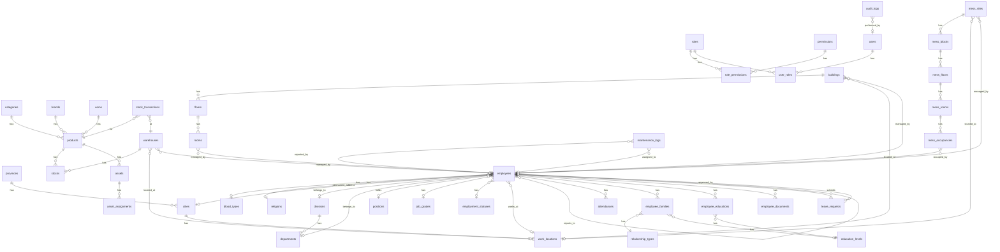

# Database Design Document

## Bebang BIS - Building Information System

---

## Table of Contents

1. [Overview](#overview)
2. [Table Summary by Module](#table-summary-by-module)
3. [Base Entity](#base-entity)
4. [Schema Details](#schema-details)
5. [Enums](#enums)
6. [Entity Relationship Diagram](#entity-relationship-diagram)
7. [Index Strategy](#index-strategy)
8. [Conventions](#conventions)

---

## Overview

| Property | Value |
|----------|-------|
| **Database** | PostgreSQL 15 |
| **ORM** | TypeORM |
| **Total Tables** | 43 |
| **Architecture** | Modular Monolith |
| **Primary Key Strategy** | UUID (v4) |
| **Soft Delete** | Yes (`deleted_at` column) |
| **Audit Trail** | Yes (`created_at`, `updated_at`, `created_by`, `updated_by`) |

---

## Table Summary by Module

| Module | Table Count | Tables |
|--------|-------------|--------|
| **Master Data** | 6 | provinces, cities, blood_types, religions, education_levels, relationship_types |
| **User Access Management** | 5 | roles, permissions, role_permissions, users, user_roles |
| **HR Core** | 6 | divisions, departments, positions, job_grades, employment_statuses, work_locations |
| **HR Extended** | 6 | employees, attendances, employee_families, employee_educations, employee_documents, leave_requests |
| **Inventory** | 9 | categories, brands, uoms, products, warehouses, stocks, stock_transactions, assets, asset_assignments |
| **Building** | 4 | buildings, floors, rooms, maintenance_logs |
| **Mess** | 5 | mess_sites, mess_blocks, mess_floors, mess_rooms, mess_occupancies |
| **Audit** | 1 | audit_logs |
| **Total** | **43** | |

---

## Base Entity

All entities (except `audit_logs`) extend the [`BaseEntity`](../backend/src/entities/base/base.entity.ts:9) class:

| Column | Type | Constraints | Description |
|--------|------|-------------|-------------|
| `id` | UUID | PK, Auto-generated | Primary key |
| `created_at` | TIMESTAMPTZ | NOT NULL, Auto | Record creation timestamp |
| `updated_at` | TIMESTAMPTZ | NOT NULL, Auto | Last update timestamp |
| `created_by` | UUID | NULLABLE | User who created the record |
| `updated_by` | UUID | NULLABLE | User who last updated the record |
| `deleted_at` | TIMESTAMPTZ | NULLABLE | Soft delete timestamp |

---

## Schema Details

### 1. Master Data (6 tables)

#### provinces
| Column | Type | Constraints | Description |
|--------|------|-------------|-------------|
| `id` | UUID | PK | Primary key |
| `code` | VARCHAR(2) | UNIQUE, NOT NULL | Province code |
| `name` | VARCHAR(100) | NOT NULL | Province name |

#### cities
| Column | Type | Constraints | Description |
|--------|------|-------------|-------------|
| `id` | UUID | PK | Primary key |
| `province_id` | UUID | FK, NOT NULL | Reference to province |
| `code` | VARCHAR(4) | NOT NULL | City code |
| `name` | VARCHAR(100) | NOT NULL | City name |

#### blood_types
| Column | Type | Constraints | Description |
|--------|------|-------------|-------------|
| `id` | UUID | PK | Primary key |
| `code` | VARCHAR(3) | UNIQUE, NOT NULL | Blood type code |
| `name` | VARCHAR(50) | NOT NULL | Blood type name |

#### religions
| Column | Type | Constraints | Description |
|--------|------|-------------|-------------|
| `id` | UUID | PK | Primary key |
| `code` | VARCHAR(20) | UNIQUE, NOT NULL | Religion code |
| `name` | VARCHAR(50) | NOT NULL | Religion name |

#### education_levels
| Column | Type | Constraints | Description |
|--------|------|-------------|-------------|
| `id` | UUID | PK | Primary key |
| `code` | VARCHAR(10) | UNIQUE, NOT NULL | Education level code |
| `name` | VARCHAR(50) | NOT NULL | Education level name |
| `level` | INT | DEFAULT 0 | Numeric level for sorting |

#### relationship_types
| Column | Type | Constraints | Description |
|--------|------|-------------|-------------|
| `id` | UUID | PK | Primary key |
| `code` | VARCHAR(20) | UNIQUE, NOT NULL | Relationship code |
| `name` | VARCHAR(50) | NOT NULL | Relationship name |

---

### 2. User Access Management (5 tables)

#### roles
| Column | Type | Constraints | Description |
|--------|------|-------------|-------------|
| `id` | UUID | PK | Primary key |
| `code` | VARCHAR(50) | UNIQUE, NOT NULL | Role code |
| `name` | VARCHAR(100) | NOT NULL | Role display name |
| `description` | TEXT | NULLABLE | Role description |
| `is_system` | BOOLEAN | DEFAULT false | System role flag |

#### permissions
| Column | Type | Constraints | Description |
|--------|------|-------------|-------------|
| `id` | UUID | PK | Primary key |
| `module` | VARCHAR(50) | NOT NULL | Module name |
| `feature` | VARCHAR(50) | NOT NULL | Feature name |
| `action` | VARCHAR(20) | NOT NULL | Action type |
| `field` | VARCHAR(50) | NULLABLE | Field-level permission |
| `code` | VARCHAR(100) | UNIQUE, NOT NULL | Permission code |
| `description` | TEXT | NULLABLE | Permission description |

#### role_permissions
| Column | Type | Constraints | Description |
|--------|------|-------------|-------------|
| `id` | UUID | PK | Primary key |
| `role_id` | UUID | FK, NOT NULL | Reference to role |
| `permission_id` | UUID | FK, NOT NULL | Reference to permission |

#### users
| Column | Type | Constraints | Description |
|--------|------|-------------|-------------|
| `id` | UUID | PK | Primary key |
| `nik` | VARCHAR(20) | UNIQUE, NOT NULL | Employee ID (login) |
| `password_hash` | VARCHAR(255) | NOT NULL | Bcrypt hashed password |
| `is_first_login` | BOOLEAN | DEFAULT true | First login flag |
| `is_active` | BOOLEAN | DEFAULT true | Account active status |
| `last_login_at` | TIMESTAMPTZ | NULLABLE | Last login timestamp |
| `employee_id` | UUID | FK, NULLABLE | Reference to employee |

#### user_roles
| Column | Type | Constraints | Description |
|--------|------|-------------|-------------|
| `id` | UUID | PK | Primary key |
| `user_id` | UUID | FK, NOT NULL | Reference to user |
| `role_id` | UUID | FK, NOT NULL | Reference to role |
| `assigned_at` | TIMESTAMPTZ | DEFAULT now() | Assignment timestamp |
| `assigned_by` | UUID | NULLABLE | Assigner user ID |

---

### 3. HR Core (6 tables)

#### divisions
| Column | Type | Constraints | Description |
|--------|------|-------------|-------------|
| `id` | UUID | PK | Primary key |
| `code` | VARCHAR(20) | UNIQUE, NOT NULL | Division code |
| `name` | VARCHAR(100) | NOT NULL | Division name |
| `description` | TEXT | NULLABLE | Division description |

#### departments
| Column | Type | Constraints | Description |
|--------|------|-------------|-------------|
| `id` | UUID | PK | Primary key |
| `division_id` | UUID | FK, NOT NULL | Reference to division |
| `code` | VARCHAR(20) | UNIQUE, NOT NULL | Department code |
| `name` | VARCHAR(100) | NOT NULL | Department name |
| `manager_id` | UUID | FK, NULLABLE | Department manager |
| `description` | TEXT | NULLABLE | Department description |

#### positions
| Column | Type | Constraints | Description |
|--------|------|-------------|-------------|
| `id` | UUID | PK | Primary key |
| `code` | VARCHAR(20) | UNIQUE, NOT NULL | Position code |
| `name` | VARCHAR(100) | NOT NULL | Position name |
| `level` | INT | DEFAULT 1 | Position level |

#### job_grades
| Column | Type | Constraints | Description |
|--------|------|-------------|-------------|
| `id` | UUID | PK | Primary key |
| `code` | VARCHAR(10) | UNIQUE, NOT NULL | Grade code |
| `name` | VARCHAR(50) | NOT NULL | Grade name |
| `min_salary` | DECIMAL(15,2) | NULLABLE | Minimum salary |
| `max_salary` | DECIMAL(15,2) | NULLABLE | Maximum salary |

#### employment_statuses
| Column | Type | Constraints | Description |
|--------|------|-------------|-------------|
| `id` | UUID | PK | Primary key |
| `code` | VARCHAR(20) | UNIQUE, NOT NULL | Status code |
| `name` | VARCHAR(100) | NOT NULL | Status name |
| `description` | TEXT | NULLABLE | Status description |

#### work_locations
| Column | Type | Constraints | Description |
|--------|------|-------------|-------------|
| `id` | UUID | PK | Primary key |
| `code` | VARCHAR(20) | UNIQUE, NOT NULL | Location code |
| `name` | VARCHAR(100) | NOT NULL | Location name |
| `address` | TEXT | NULLABLE | Full address |
| `city_id` | UUID | FK, NULLABLE | Reference to city |

---

### 4. HR Extended (6 tables)

#### employees
| Column | Type | Constraints | Description |
|--------|------|-------------|-------------|
| `id` | UUID | PK | Primary key |
| `nik` | VARCHAR(20) | UNIQUE, NOT NULL | Employee ID number |
| `full_name` | VARCHAR(200) | NOT NULL | Full legal name |
| `nickname` | VARCHAR(100) | NULLABLE | Preferred name |
| `id_card_number` | VARCHAR(16) | UNIQUE, NOT NULL | National ID (KTP) |
| `birth_place` | VARCHAR(100) | NOT NULL | Place of birth |
| `birth_date` | DATE | NOT NULL | Date of birth |
| `gender` | gender_enum | NOT NULL | Gender (L/P) |
| `blood_type_id` | UUID | FK, NULLABLE | Blood type reference |
| `religion_id` | UUID | FK, NULLABLE | Religion reference |
| `marital_status` | marital_status_enum | DEFAULT 'SINGLE' | Marital status |
| `phone_number` | VARCHAR(20) | NULLABLE | Phone number |
| `email` | VARCHAR(100) | NULLABLE | Email address |
| `photo_url` | VARCHAR(255) | NULLABLE | Profile photo URL |
| `address` | TEXT | NULLABLE | Permanent address |
| `city_id` | UUID | FK, NULLABLE | Permanent city |
| `postal_code` | VARCHAR(10) | NULLABLE | Postal code |
| `current_address` | TEXT | NULLABLE | Current address |
| `current_city_id` | UUID | FK, NULLABLE | Current city |
| `division_id` | UUID | FK, NULLABLE | Division reference |
| `department_id` | UUID | FK, NULLABLE | Department reference |
| `position_id` | UUID | FK, NULLABLE | Position reference |
| `job_grade_id` | UUID | FK, NULLABLE | Job grade reference |
| `employment_status_id` | UUID | FK, NULLABLE | Employment status |
| `work_location_id` | UUID | FK, NULLABLE | Work location |
| `manager_id` | UUID | FK, NULLABLE | Direct manager (self-ref) |
| `join_date` | DATE | NULLABLE | Employment start date |
| `permanent_date` | DATE | NULLABLE | Permanent date |
| `contract_start_date` | DATE | NULLABLE | Contract start |
| `contract_end_date` | DATE | NULLABLE | Contract end |
| `resign_date` | DATE | NULLABLE | Resignation date |
| `resign_reason` | TEXT | NULLABLE | Resignation reason |
| `employee_status` | employee_status_enum | DEFAULT 'ACTIVE' | Employee status |
| `basic_salary` | DECIMAL(15,2) | NULLABLE | Basic salary |
| `bank_name` | VARCHAR(100) | NULLABLE | Bank name |
| `bank_account_number` | VARCHAR(50) | NULLABLE | Bank account |
| `bank_account_holder` | VARCHAR(200) | NULLABLE | Account holder |
| `tax_number` | VARCHAR(30) | NULLABLE | Tax ID (NPWP) |
| `bpjs_kesehatan` | VARCHAR(30) | NULLABLE | BPJS Kesehatan |
| `bpjs_ketenagakerjaan` | VARCHAR(30) | NULLABLE | BPJS TK |
| `annual_leave_balance` | INT | DEFAULT 12 | Annual leave days |
| `sick_leave_balance` | INT | DEFAULT 12 | Sick leave days |

#### attendances
| Column | Type | Constraints | Description |
|--------|------|-------------|-------------|
| `id` | UUID | PK | Primary key |
| `employee_id` | UUID | FK, NOT NULL | Employee reference |
| `attendance_date` | DATE | NOT NULL | Attendance date |
| `clock_in_time` | TIMESTAMPTZ | NULLABLE | Clock in time |
| `clock_in_location` | JSONB | NULLABLE | Clock in GPS |
| `clock_in_method` | clock_in_method_enum | NULLABLE | Clock in method |
| `clock_out_time` | TIMESTAMPTZ | NULLABLE | Clock out time |
| `clock_out_location` | JSONB | NULLABLE | Clock out GPS |
| `work_hours` | DECIMAL(4,2) | NULLABLE | Total work hours |
| `status` | attendance_status_enum | DEFAULT 'PRESENT' | Status |
| `notes` | TEXT | NULLABLE | Notes |

#### employee_families
| Column | Type | Constraints | Description |
|--------|------|-------------|-------------|
| `id` | UUID | PK | Primary key |
| `employee_id` | UUID | FK, NOT NULL | Employee reference |
| `relationship_type_id` | UUID | FK, NOT NULL | Relationship type |
| `full_name` | VARCHAR(200) | NOT NULL | Family member name |
| `birth_date` | DATE | NULLABLE | Date of birth |
| `gender` | gender_enum | NULLABLE | Gender |
| `education_level_id` | UUID | FK, NULLABLE | Education level |
| `occupation` | VARCHAR(100) | NULLABLE | Occupation |
| `is_emergency_contact` | BOOLEAN | DEFAULT false | Emergency contact |
| `phone_number` | VARCHAR(20) | NULLABLE | Phone number |

#### employee_educations
| Column | Type | Constraints | Description |
|--------|------|-------------|-------------|
| `id` | UUID | PK | Primary key |
| `employee_id` | UUID | FK, NOT NULL | Employee reference |
| `education_level_id` | UUID | FK, NOT NULL | Education level |
| `institution_name` | VARCHAR(200) | NOT NULL | Institution name |
| `major` | VARCHAR(100) | NULLABLE | Field of study |
| `start_year` | INT | NOT NULL | Start year |
| `end_year` | INT | NULLABLE | Graduation year |
| `gpa` | DECIMAL(3,2) | NULLABLE | GPA |
| `certificate_number` | VARCHAR(100) | NULLABLE | Certificate number |
| `certificate_url` | VARCHAR(255) | NULLABLE | Certificate URL |

#### employee_documents
| Column | Type | Constraints | Description |
|--------|------|-------------|-------------|
| `id` | UUID | PK | Primary key |
| `employee_id` | UUID | FK, NOT NULL | Employee reference |
| `document_type` | document_type_enum | NOT NULL | Document type |
| `document_name` | VARCHAR(200) | NOT NULL | Document name |
| `file_url` | VARCHAR(255) | NOT NULL | File URL |
| `file_size` | INT | NOT NULL | File size (bytes) |
| `uploaded_at` | TIMESTAMPTZ | DEFAULT now() | Upload timestamp |

#### leave_requests
| Column | Type | Constraints | Description |
|--------|------|-------------|-------------|
| `id` | UUID | PK | Primary key |
| `employee_id` | UUID | FK, NOT NULL | Employee reference |
| `leave_type` | leave_type_enum | NOT NULL | Leave type |
| `start_date` | DATE | NOT NULL | Start date |
| `end_date` | DATE | NOT NULL | End date |
| `total_days` | INT | NOT NULL | Total days |
| `reason` | TEXT | NOT NULL | Leave reason |
| `attachment_url` | VARCHAR(255) | NULLABLE | Attachment URL |
| `status` | leave_status_enum | DEFAULT 'PENDING' | Request status |
| `approver_id` | UUID | FK, NULLABLE | Approver reference |
| `approved_at` | TIMESTAMPTZ | NULLABLE | Approval timestamp |
| `approval_notes` | TEXT | NULLABLE | Approval notes |
| `delegate_approver_id` | UUID | FK, NULLABLE | Delegate approver |

---

### 5. Inventory (9 tables)

#### categories
| Column | Type | Constraints | Description |
|--------|------|-------------|-------------|
| `id` | UUID | PK | Primary key |
| `code` | VARCHAR(20) | UNIQUE, NOT NULL | Category code |
| `name` | VARCHAR(100) | NOT NULL | Category name |
| `type` | category_type_enum | NOT NULL | FIXED/CONSUMABLE |
| `description` | TEXT | NULLABLE | Description |

#### brands
| Column | Type | Constraints | Description |
|--------|------|-------------|-------------|
| `id` | UUID | PK | Primary key |
| `code` | VARCHAR(20) | UNIQUE, NOT NULL | Brand code |
| `name` | VARCHAR(100) | NOT NULL | Brand name |

#### uoms
| Column | Type | Constraints | Description |
|--------|------|-------------|-------------|
| `id` | UUID | PK | Primary key |
| `code` | VARCHAR(10) | UNIQUE, NOT NULL | UOM code |
| `name` | VARCHAR(50) | NOT NULL | UOM name |

#### products
| Column | Type | Constraints | Description |
|--------|------|-------------|-------------|
| `id` | UUID | PK | Primary key |
| `sku` | VARCHAR(50) | UNIQUE, NOT NULL | SKU |
| `name` | VARCHAR(200) | NOT NULL | Product name |
| `category_id` | UUID | FK, NOT NULL | Category reference |
| `brand_id` | UUID | FK, NULLABLE | Brand reference |
| `uom_id` | UUID | FK, NOT NULL | UOM reference |
| `description` | TEXT | NULLABLE | Description |
| `specifications` | JSONB | NULLABLE | Technical specs |
| `is_asset` | BOOLEAN | DEFAULT false | Fixed asset flag |
| `min_stock` | INT | DEFAULT 0 | Minimum stock |
| `photo_url` | VARCHAR(255) | NULLABLE | Photo URL |

#### warehouses
| Column | Type | Constraints | Description |
|--------|------|-------------|-------------|
| `id` | UUID | PK | Primary key |
| `code` | VARCHAR(20) | UNIQUE, NOT NULL | Warehouse code |
| `name` | VARCHAR(100) | NOT NULL | Warehouse name |
| `work_location_id` | UUID | FK, NULLABLE | Work location |
| `address` | TEXT | NULLABLE | Address |
| `pic_employee_id` | UUID | FK, NULLABLE | Person in charge |

#### stocks
| Column | Type | Constraints | Description |
|--------|------|-------------|-------------|
| `id` | UUID | PK | Primary key |
| `product_id` | UUID | FK, NOT NULL | Product reference |
| `warehouse_id` | UUID | FK, NOT NULL | Warehouse reference |
| `quantity` | INT | DEFAULT 0 | Current quantity |
| `last_stock_opname_date` | DATE | NULLABLE | Last stock count |

#### stock_transactions
| Column | Type | Constraints | Description |
|--------|------|-------------|-------------|
| `id` | UUID | PK | Primary key |
| `transaction_number` | VARCHAR(50) | UNIQUE, NOT NULL | Transaction number |
| `transaction_type` | transaction_type_enum | NOT NULL | Transaction type |
| `transaction_date` | DATE | NOT NULL | Transaction date |
| `product_id` | UUID | FK, NOT NULL | Product reference |
| `warehouse_id` | UUID | FK, NOT NULL | Warehouse reference |
| `quantity` | INT | NOT NULL | Quantity |
| `from_warehouse_id` | UUID | FK, NULLABLE | Source warehouse |
| `to_warehouse_id` | UUID | FK, NULLABLE | Destination warehouse |
| `reference_number` | VARCHAR(100) | NULLABLE | External reference |
| `notes` | TEXT | NULLABLE | Notes |
| `approved_by` | UUID | FK, NULLABLE | Approver |

#### assets
| Column | Type | Constraints | Description |
|--------|------|-------------|-------------|
| `id` | UUID | PK | Primary key |
| `asset_code` | VARCHAR(50) | UNIQUE, NOT NULL | Asset code |
| `product_id` | UUID | FK, NOT NULL | Product reference |
| `serial_number` | VARCHAR(100) | NULLABLE | Serial number |
| `purchase_date` | DATE | NULLABLE | Purchase date |
| `purchase_price` | DECIMAL(15,2) | NULLABLE | Purchase price |
| `warranty_end_date` | DATE | NULLABLE | Warranty end |
| `qr_code` | VARCHAR(255) | UNIQUE, NOT NULL | QR code |
| `status` | asset_status_enum | DEFAULT 'NEW' | Asset status |
| `condition` | asset_condition_enum | DEFAULT 'EXCELLENT' | Condition |
| `current_location_type` | location_type_enum | NULLABLE | Location type |
| `current_location_id` | UUID | NULLABLE | Location ID |
| `notes` | TEXT | NULLABLE | Notes |

#### asset_assignments
| Column | Type | Constraints | Description |
|--------|------|-------------|-------------|
| `id` | UUID | PK | Primary key |
| `asset_id` | UUID | FK, NOT NULL | Asset reference |
| `assignment_type` | assignment_type_enum | NOT NULL | Assignment type |
| `assigned_to_id` | UUID | NOT NULL | Assignee ID |
| `assigned_date` | DATE | NOT NULL | Assignment date |
| `return_date` | DATE | NULLABLE | Return date |
| `handover_document_url` | VARCHAR(255) | NULLABLE | Handover doc |
| `condition_on_handover` | asset_condition_enum | NOT NULL | Handover condition |
| `condition_on_return` | asset_condition_enum | NULLABLE | Return condition |
| `notes` | TEXT | NULLABLE | Notes |
| `is_active` | BOOLEAN | DEFAULT true | Active flag |

---

### 6. Building (4 tables)

#### buildings
| Column | Type | Constraints | Description |
|--------|------|-------------|-------------|
| `id` | UUID | PK | Primary key |
| `code` | VARCHAR(20) | UNIQUE, NOT NULL | Building code |
| `name` | VARCHAR(100) | NOT NULL | Building name |
| `work_location_id` | UUID | FK, NULLABLE | Work location |
| `address` | TEXT | NULLABLE | Address |
| `total_floors` | INT | DEFAULT 1 | Total floors |
| `pic_employee_id` | UUID | FK, NULLABLE | Person in charge |
| `description` | TEXT | NULLABLE | Description |

#### floors
| Column | Type | Constraints | Description |
|--------|------|-------------|-------------|
| `id` | UUID | PK | Primary key |
| `building_id` | UUID | FK, NOT NULL | Building reference |
| `floor_number` | INT | NOT NULL | Floor number |
| `floor_name` | VARCHAR(50) | NOT NULL | Floor name |

#### rooms
| Column | Type | Constraints | Description |
|--------|------|-------------|-------------|
| `id` | UUID | PK | Primary key |
| `floor_id` | UUID | FK, NOT NULL | Floor reference |
| `room_number` | VARCHAR(20) | NOT NULL | Room number |
| `room_name` | VARCHAR(100) | NOT NULL | Room name |
| `room_type` | room_type_enum | DEFAULT 'OFFICE' | Room type |
| `capacity` | INT | NULLABLE | Capacity |
| `area_sqm` | DECIMAL(8,2) | NULLABLE | Area (sqm) |
| `pic_employee_id` | UUID | FK, NULLABLE | Person in charge |
| `status` | room_status_enum | DEFAULT 'AVAILABLE' | Status |
| `facilities` | JSONB | NULLABLE | Facilities |

#### maintenance_logs
| Column | Type | Constraints | Description |
|--------|------|-------------|-------------|
| `id` | UUID | PK | Primary key |
| `maintenance_type` | maintenance_type_enum | NOT NULL | Maintenance type |
| `reference_id` | UUID | NOT NULL | Building/room ID |
| `issue_description` | TEXT | NOT NULL | Issue description |
| `reported_by` | UUID | FK, NOT NULL | Reporter |
| `reported_date` | DATE | NOT NULL | Report date |
| `priority` | maintenance_priority_enum | DEFAULT 'MEDIUM' | Priority |
| `status` | maintenance_status_enum | DEFAULT 'REPORTED' | Status |
| `assigned_to` | UUID | FK, NULLABLE | Assigned technician |
| `completion_date` | DATE | NULLABLE | Completion date |
| `completion_notes` | TEXT | NULLABLE | Completion notes |
| `cost` | DECIMAL(15,2) | NULLABLE | Cost |

---

### 7. Mess (5 tables)

#### mess_sites
| Column | Type | Constraints | Description |
|--------|------|-------------|-------------|
| `id` | UUID | PK | Primary key |
| `code` | VARCHAR(20) | UNIQUE, NOT NULL | Site code |
| `name` | VARCHAR(100) | NOT NULL | Site name |
| `work_location_id` | UUID | FK, NULLABLE | Work location |
| `address` | TEXT | NULLABLE | Address |
| `pic_employee_id` | UUID | FK, NULLABLE | Person in charge |
| `description` | TEXT | NULLABLE | Description |

#### mess_blocks
| Column | Type | Constraints | Description |
|--------|------|-------------|-------------|
| `id` | UUID | PK | Primary key |
| `mess_site_id` | UUID | FK, NOT NULL | Mess site reference |
| `block_code` | VARCHAR(20) | NOT NULL | Block code |
| `block_name` | VARCHAR(100) | NOT NULL | Block name |
| `total_floors` | INT | DEFAULT 1 | Total floors |
| `description` | TEXT | NULLABLE | Description |

#### mess_floors
| Column | Type | Constraints | Description |
|--------|------|-------------|-------------|
| `id` | UUID | PK | Primary key |
| `mess_block_id` | UUID | FK, NOT NULL | Mess block reference |
| `floor_number` | INT | NOT NULL | Floor number |
| `floor_name` | VARCHAR(50) | NOT NULL | Floor name |

#### mess_rooms
| Column | Type | Constraints | Description |
|--------|------|-------------|-------------|
| `id` | UUID | PK | Primary key |
| `mess_floor_id` | UUID | FK, NOT NULL | Mess floor reference |
| `room_number` | VARCHAR(20) | NOT NULL | Room number |
| `room_type` | mess_room_type_enum | DEFAULT 'SINGLE' | Room type |
| `capacity` | INT | DEFAULT 1 | Capacity |
| `status` | mess_room_status_enum | DEFAULT 'AVAILABLE' | Status |
| `facilities` | JSONB | NULLABLE | Facilities |

#### mess_occupancies
| Column | Type | Constraints | Description |
|--------|------|-------------|-------------|
| `id` | UUID | PK | Primary key |
| `mess_room_id` | UUID | FK, NOT NULL | Mess room reference |
| `employee_id` | UUID | FK, NOT NULL | Employee reference |
| `check_in_date` | DATE | NOT NULL | Check-in date |
| `check_out_date` | DATE | NULLABLE | Check-out date |
| `expected_check_out_date` | DATE | NULLABLE | Expected check-out |
| `status` | occupancy_status_enum | DEFAULT 'ACTIVE' | Status |
| `notes` | TEXT | NULLABLE | Notes |

---

### 8. Audit (1 table)

#### audit_logs

> **Note:** This table does NOT extend BaseEntity.

| Column | Type | Constraints | Description |
|--------|------|-------------|-------------|
| `id` | UUID | PK | Primary key |
| `module` | VARCHAR(50) | NULLABLE | Module name |
| `entity_type` | VARCHAR(100) | NULLABLE | Entity type |
| `table_name` | VARCHAR(100) | NOT NULL | Affected table |
| `record_id` | UUID | NULLABLE | Affected record ID |
| `action` | audit_action_enum | NOT NULL | Action type |
| `description` | TEXT | NULLABLE | Action description |
| `old_value` | JSONB | NULLABLE | Previous values |
| `new_value` | JSONB | NULLABLE | New values |
| `user_id` | UUID | FK, NULLABLE | User who performed action |
| `ip_address` | VARCHAR(45) | NULLABLE | Client IP address |
| `user_agent` | TEXT | NULLABLE | Client user agent |
| `created_at` | TIMESTAMPTZ | NOT NULL, Auto | Timestamp |

---

## Enums

### HR Enums

| Enum Name | Values |
|-----------|--------|
| `gender_enum` | `L`, `P` |
| `marital_status_enum` | `SINGLE`, `MARRIED`, `DIVORCED`, `WIDOWED` |
| `employee_status_enum` | `ACTIVE`, `ON_LEAVE`, `RESIGNED`, `TERMINATED` |
| `attendance_status_enum` | `PRESENT`, `LATE`, `ABSENT`, `LEAVE`, `SICK`, `PERMIT` |
| `clock_in_method_enum` | `QR`, `MANUAL`, `LOCATION` |
| `document_type_enum` | `KTP`, `KK`, `IJAZAH`, `SERTIFIKAT`, `KONTRAK`, `SK`, `OTHER` |
| `leave_type_enum` | `ANNUAL`, `SICK`, `MATERNITY`, `PATERNITY`, `UNPAID`, `PERMIT` |
| `leave_status_enum` | `PENDING`, `APPROVED`, `REJECTED`, `CANCELLED` |

### Inventory Enums

| Enum Name | Values |
|-----------|--------|
| `category_type_enum` | `FIXED`, `CONSUMABLE` |
| `transaction_type_enum` | `INBOUND`, `OUTBOUND`, `ADJUSTMENT`, `TRANSFER` |
| `asset_status_enum` | `NEW`, `AVAILABLE`, `IN_USE`, `BROKEN`, `MAINTENANCE`, `SCRAP` |
| `asset_condition_enum` | `EXCELLENT`, `GOOD`, `FAIR`, `POOR` |
| `location_type_enum` | `WAREHOUSE`, `EMPLOYEE`, `ROOM`, `MESS` |
| `assignment_type_enum` | `EMPLOYEE`, `ROOM`, `MESS` |

### Building Enums

| Enum Name | Values |
|-----------|--------|
| `room_type_enum` | `OFFICE`, `MEETING`, `STORAGE`, `SERVER`, `TOILET`, `PANTRY`, `OTHER` |
| `room_status_enum` | `AVAILABLE`, `OCCUPIED`, `MAINTENANCE`, `CLOSED` |
| `maintenance_type_enum` | `BUILDING`, `ROOM`, `FACILITY` |
| `maintenance_priority_enum` | `LOW`, `MEDIUM`, `HIGH`, `URGENT` |
| `maintenance_status_enum` | `REPORTED`, `IN_PROGRESS`, `COMPLETED`, `CANCELLED` |

### Mess Enums

| Enum Name | Values |
|-----------|--------|
| `mess_room_type_enum` | `SINGLE`, `DOUBLE`, `SHARED`, `VIP` |
| `mess_room_status_enum` | `AVAILABLE`, `OCCUPIED`, `MAINTENANCE`, `RESERVED` |
| `occupancy_status_enum` | `ACTIVE`, `CHECKED_OUT`, `CANCELLED` |

### Audit Enums

| Enum Name | Values |
|-----------|--------|
| `audit_action_enum` | `CREATE`, `UPDATE`, `DELETE`, `SOFT_DELETE`, `RESTORE`, `LOGIN`, `LOGOUT`, `EXPORT`, `IMPORT` |

---

## Entity Relationship Diagram

---

## Index Strategy

### Primary Key Indexes
All tables have a primary key index on the `id` column (UUID).

### Unique Indexes

| Table | Column(s) | Purpose |
|-------|-----------|---------|
| provinces | `code` | Unique province codes |
| blood_types | `code` | Unique blood type codes |
| religions | `code` | Unique religion codes |
| education_levels | `code` | Unique education level codes |
| relationship_types | `code` | Unique relationship type codes |
| roles | `code` | Unique role codes |
| permissions | `code` | Unique permission codes |
| role_permissions | `role_id`, `permission_id` | Prevent duplicate role-permission assignments |
| users | `nik` | Unique employee ID for login |
| user_roles | `user_id`, `role_id` | Prevent duplicate user-role assignments |
| divisions | `code` | Unique division codes |
| departments | `code` | Unique department codes |
| positions | `code` | Unique position codes |
| job_grades | `code` | Unique job grade codes |
| employment_statuses | `code` | Unique employment status codes |
| work_locations | `code` | Unique work location codes |
| employees | `nik` | Unique employee ID |
| employees | `id_card_number` | Unique national ID |
| attendances | `employee_id`, `attendance_date` | One attendance per employee per day |
| categories | `code` | Unique category codes |
| brands | `code` | Unique brand codes |
| uoms | `code` | Unique UOM codes |
| products | `sku` | Unique SKU |
| warehouses | `code` | Unique warehouse codes |
| stocks | `product_id`, `warehouse_id` | One stock record per product per warehouse |
| stock_transactions | `transaction_number` | Unique transaction numbers |
| assets | `asset_code` | Unique asset codes |
| assets | `qr_code` | Unique QR codes |
| buildings | `code` | Unique building codes |
| floors | `building_id`, `floor_number` | Unique floor per building |
| mess_sites | `code` | Unique mess site codes |
| mess_blocks | `mess_site_id`, `block_code` | Unique block per site |
| mess_floors | `mess_block_id`, `floor_number` | Unique floor per block |
| mess_rooms | `mess_floor_id`, `room_number` | Unique room per floor |

### Composite Indexes

| Table | Column(s) | Purpose |
|-------|-----------|---------|
| permissions | `module`, `feature`, `action` | Fast permission lookups |
| audit_logs | `table_name`, `record_id` | Query audit by entity |
| audit_logs | `user_id`, `created_at` | Query audit by user |
| audit_logs | `action`, `created_at` | Query audit by action |
| audit_logs | `module`, `created_at` | Query audit by module |
| mess_occupancies | `mess_room_id`, `status` | Room occupancy queries |
| mess_occupancies | `employee_id`, `status` | Employee occupancy queries |

### Partial Unique Indexes

| Table | Column(s) | Condition | Purpose |
|-------|-----------|-----------|---------|
| mess_occupancies | `employee_id` | `status = 'ACTIVE'` | One active occupancy per employee |

### Performance Indexes

| Table | Column(s) | Purpose |
|-------|-----------|---------|
| users | `nik` | Fast login lookups |
| employees | `nik` | Fast employee lookups |
| employees | `id_card_number` | Fast ID card lookups |
| attendances | `attendance_date` | Date-based queries |
| products | `sku` | Fast product lookups |
| stock_transactions | `transaction_number` | Fast transaction lookups |
| assets | `asset_code` | Fast asset lookups |
| assets | `serial_number` | Serial number searches |

---

## Conventions

### Naming Conventions

| Type | Convention | Example |
|------|------------|---------|
| Table names | snake_case, plural | `employees`, `leave_requests` |
| Column names | snake_case | `created_at`, `employee_id` |
| Entity classes | PascalCase, singular | `Employee`, `LeaveRequest` |
| Entity properties | camelCase | `createdAt`, `employeeId` |
| Enum names | PascalCase | `EmployeeStatus`, `LeaveType` |
| Enum values | UPPER_SNAKE_CASE | `ON_LEAVE`, `SOFT_DELETE` |

### Primary Keys
- All tables use UUID v4 as primary key
- Generated automatically by TypeORM
- Column name: `id`

### Foreign Keys
- Named as `{referenced_table_singular}_id`
- Example: `employee_id`, `department_id`
- Always indexed

### Timestamps
- `created_at`: Record creation time (auto)
- `updated_at`: Last update time (auto)
- `deleted_at`: Soft delete timestamp (nullable)
- All timestamps use `TIMESTAMPTZ` type

### Audit Columns
- `created_by`: UUID of user who created the record
- `updated_by`: UUID of user who last updated the record
- Both are nullable (system operations may not have a user)

### Soft Delete
- All entities (except AuditLog) support soft delete
- Implemented via `deleted_at` column
- Queries automatically filter soft-deleted records
- Use `withDeleted()` to include soft-deleted records

### JSONB Columns
Used for flexible/dynamic data:
- `clock_in_location` / `clock_out_location`: GPS coordinates `{lat, lng, address}`
- `specifications`: Product technical specs
- `facilities`: Room/mess facilities

---

## Document History

| Version | Date | Author | Changes |
|---------|------|--------|---------|
| 1.0 | 2024-12-27 | System | Initial documentation |