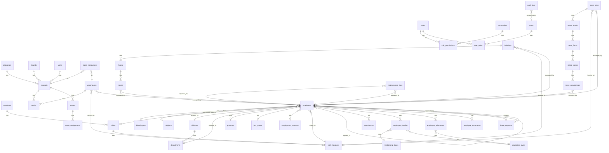

# Database Implementation Documentation

## Overview

| Property | Value |
|----------|-------|
| **Database** | PostgreSQL 15 |
| **ORM** | TypeORM |
| **Total Tables** | 43 |
| **Architecture** | Modular Monolith |
| **Primary Key Strategy** | UUID (v4) |
| **Soft Delete** | Yes (deleted_at column) |
| **Audit Trail** | Yes (created_at, updated_at, created_by, updated_by) |

### Entity Groups Summary

| Group | Tables | Description |
|-------|--------|-------------|
| Master Data | 6 | Reference data (provinces, cities, blood types, etc.) |
| User Access Management | 5 | Authentication and authorization |
| HR Core | 6 | Organizational structure |
| HR Extended | 6 | Employee data and operations |
| Inventory | 9 | Products, stocks, and assets |
| Building | 4 | Building and room management |
| Mess | 5 | Employee housing management |
| Audit | 1 | System audit logs |

---

## Base Entity

All entities (except [`AuditLog`](backend/src/entities/audit/audit-log.entity.ts:28)) extend the [`BaseEntity`](backend/src/entities/base/base.entity.ts:9) class which provides common audit columns:

| Column | Type | Constraints | Description |
|--------|------|-------------|-------------|
| `id` | UUID | PK, Auto-generated | Primary key |
| `created_at` | TIMESTAMPTZ | NOT NULL, Auto | Record creation timestamp |
| `updated_at` | TIMESTAMPTZ | NOT NULL, Auto | Last update timestamp |
| `created_by` | UUID | NULLABLE | User who created the record |
| `updated_by` | UUID | NULLABLE | User who last updated the record |
| `deleted_at` | TIMESTAMPTZ | NULLABLE | Soft delete timestamp |

---

## Entity Groups

### 1. Master Data (6 tables)

Master data tables store reference information used throughout the application.

#### 1.1 provinces

**Entity:** [`Province`](backend/src/entities/master-data/province.entity.ts:6)

**Description:** Indonesian provinces reference data.

| Column | Type | Constraints | Description |
|--------|------|-------------|-------------|
| `id` | UUID | PK | Primary key |
| `code` | VARCHAR(2) | UNIQUE, NOT NULL | Province code (e.g., "11", "12") |
| `name` | VARCHAR(100) | NOT NULL | Province name |
| *Base columns* | | | Inherited from BaseEntity |

**Relationships:**
- One-to-Many → [`cities`](#12-cities)

**Indexes:**
- Primary key on `id`
- Unique index on `code`

---

#### 1.2 cities

**Entity:** [`City`](backend/src/entities/master-data/city.entity.ts:6)

**Description:** Indonesian cities/regencies reference data.

| Column | Type | Constraints | Description |
|--------|------|-------------|-------------|
| `id` | UUID | PK | Primary key |
| `province_id` | UUID | FK, NOT NULL | Reference to province |
| `code` | VARCHAR(4) | NOT NULL | City code |
| `name` | VARCHAR(100) | NOT NULL | City name |
| *Base columns* | | | Inherited from BaseEntity |

**Relationships:**
- Many-to-One → [`provinces`](#11-provinces)

**Indexes:**
- Primary key on `id`
- Foreign key index on `province_id`

---

#### 1.3 blood_types

**Entity:** [`BloodType`](backend/src/entities/master-data/blood-type.entity.ts:5)

**Description:** Blood type reference data.

| Column | Type | Constraints | Description |
|--------|------|-------------|-------------|
| `id` | UUID | PK | Primary key |
| `code` | VARCHAR(3) | UNIQUE, NOT NULL | Blood type code (e.g., "A", "B", "AB", "O") |
| `name` | VARCHAR(50) | NOT NULL | Blood type name with Rh factor |
| *Base columns* | | | Inherited from BaseEntity |

**Indexes:**
- Primary key on `id`
- Unique index on `code`

---

#### 1.4 religions

**Entity:** [`Religion`](backend/src/entities/master-data/religion.entity.ts:5)

**Description:** Religion reference data.

| Column | Type | Constraints | Description |
|--------|------|-------------|-------------|
| `id` | UUID | PK | Primary key |
| `code` | VARCHAR(20) | UNIQUE, NOT NULL | Religion code |
| `name` | VARCHAR(50) | NOT NULL | Religion name |
| *Base columns* | | | Inherited from BaseEntity |

**Indexes:**
- Primary key on `id`
- Unique index on `code`

---

#### 1.5 education_levels

**Entity:** [`EducationLevel`](backend/src/entities/master-data/education-level.entity.ts:5)

**Description:** Education level reference data.

| Column | Type | Constraints | Description |
|--------|------|-------------|-------------|
| `id` | UUID | PK | Primary key |
| `code` | VARCHAR(10) | UNIQUE, NOT NULL | Education level code (e.g., "SD", "SMP", "S1") |
| `name` | VARCHAR(50) | NOT NULL | Education level name |
| `level` | INT | DEFAULT 0 | Numeric level for sorting/comparison |
| *Base columns* | | | Inherited from BaseEntity |

**Indexes:**
- Primary key on `id`
- Unique index on `code`

---

#### 1.6 relationship_types

**Entity:** [`RelationshipType`](backend/src/entities/master-data/relationship-type.entity.ts:5)

**Description:** Family relationship type reference data.

| Column | Type | Constraints | Description |
|--------|------|-------------|-------------|
| `id` | UUID | PK | Primary key |
| `code` | VARCHAR(20) | UNIQUE, NOT NULL | Relationship code (e.g., "SPOUSE", "CHILD") |
| `name` | VARCHAR(50) | NOT NULL | Relationship name |
| *Base columns* | | | Inherited from BaseEntity |

**Indexes:**
- Primary key on `id`
- Unique index on `code`

---

### 2. User Access Management (5 tables)

User access management tables handle authentication, authorization, and role-based access control (RBAC).

#### 2.1 roles

**Entity:** [`Role`](backend/src/entities/user-access/role.entity.ts:7)

**Description:** System roles for access control.

| Column | Type | Constraints | Description |
|--------|------|-------------|-------------|
| `id` | UUID | PK | Primary key |
| `code` | VARCHAR(50) | UNIQUE, NOT NULL | Role code (e.g., "ADMIN", "HR_MANAGER") |
| `name` | VARCHAR(100) | NOT NULL | Role display name |
| `description` | TEXT | NULLABLE | Role description |
| `is_system` | BOOLEAN | DEFAULT false | System role flag (cannot be deleted) |
| *Base columns* | | | Inherited from BaseEntity |

**Relationships:**
- One-to-Many → [`role_permissions`](#23-role_permissions)
- One-to-Many → [`user_roles`](#25-user_roles)

**Indexes:**
- Primary key on `id`
- Unique index on `code`

---

#### 2.2 permissions

**Entity:** [`Permission`](backend/src/entities/user-access/permission.entity.ts:6)

**Description:** Granular permissions for feature access control.

| Column | Type | Constraints | Description |
|--------|------|-------------|-------------|
| `id` | UUID | PK | Primary key |
| `module` | VARCHAR(50) | NOT NULL | Module name (e.g., "hr", "inventory") |
| `feature` | VARCHAR(50) | NOT NULL | Feature name (e.g., "employee", "product") |
| `action` | VARCHAR(20) | NOT NULL | Action type (e.g., "create", "read", "update", "delete") |
| `field` | VARCHAR(50) | NULLABLE | Specific field for field-level permissions |
| `code` | VARCHAR(100) | UNIQUE, NOT NULL | Permission code (e.g., "hr.employee.create") |
| `description` | TEXT | NULLABLE | Permission description |
| *Base columns* | | | Inherited from BaseEntity |

**Relationships:**
- One-to-Many → [`role_permissions`](#23-role_permissions)

**Indexes:**
- Primary key on `id`
- Unique index on `code`
- Composite index on (`module`, `feature`, `action`)

---

#### 2.3 role_permissions

**Entity:** [`RolePermission`](backend/src/entities/user-access/role-permission.entity.ts:8)

**Description:** Junction table linking roles to permissions.

| Column | Type | Constraints | Description |
|--------|------|-------------|-------------|
| `id` | UUID | PK | Primary key |
| `role_id` | UUID | FK, NOT NULL | Reference to role |
| `permission_id` | UUID | FK, NOT NULL | Reference to permission |
| *Base columns* | | | Inherited from BaseEntity |

**Relationships:**
- Many-to-One → [`roles`](#21-roles)
- Many-to-One → [`permissions`](#22-permissions)

**Indexes:**
- Primary key on `id`
- Unique composite index on (`role_id`, `permission_id`)

---

#### 2.4 users

**Entity:** [`User`](backend/src/entities/user-access/user.entity.ts:6)

**Description:** System user accounts for authentication.

| Column | Type | Constraints | Description |
|--------|------|-------------|-------------|
| `id` | UUID | PK | Primary key |
| `nik` | VARCHAR(20) | UNIQUE, NOT NULL, INDEX | Employee ID number (login identifier) |
| `password_hash` | VARCHAR(255) | NOT NULL | Bcrypt hashed password |
| `is_first_login` | BOOLEAN | DEFAULT true | First login flag for password change |
| `is_active` | BOOLEAN | DEFAULT true | Account active status |
| `last_login_at` | TIMESTAMPTZ | NULLABLE | Last successful login timestamp |
| `employee_id` | UUID | NULLABLE | Reference to employee record |
| *Base columns* | | | Inherited from BaseEntity |

**Relationships:**
- One-to-Many → [`user_roles`](#25-user_roles)

**Indexes:**
- Primary key on `id`
- Unique index on `nik`

---

#### 2.5 user_roles

**Entity:** [`UserRole`](backend/src/entities/user-access/user-role.entity.ts:8)

**Description:** Junction table linking users to roles.

| Column | Type | Constraints | Description |
|--------|------|-------------|-------------|
| `id` | UUID | PK | Primary key |
| `user_id` | UUID | FK, NOT NULL | Reference to user |
| `role_id` | UUID | FK, NOT NULL | Reference to role |
| `assigned_at` | TIMESTAMPTZ | DEFAULT CURRENT_TIMESTAMP | Role assignment timestamp |
| `assigned_by` | UUID | NULLABLE | User who assigned the role |
| *Base columns* | | | Inherited from BaseEntity |

**Relationships:**
- Many-to-One → [`users`](#24-users)
- Many-to-One → [`roles`](#21-roles)

**Indexes:**
- Primary key on `id`
- Unique composite index on (`user_id`, `role_id`)

---

### 3. HR Core (6 tables)

HR Core tables define the organizational structure.

#### 3.1 divisions

**Entity:** [`Division`](backend/src/entities/hr/division.entity.ts:6)

**Description:** Company divisions/business units.

| Column | Type | Constraints | Description |
|--------|------|-------------|-------------|
| `id` | UUID | PK | Primary key |
| `code` | VARCHAR(20) | UNIQUE, NOT NULL | Division code |
| `name` | VARCHAR(100) | NOT NULL | Division name |
| `description` | TEXT | NULLABLE | Division description |
| *Base columns* | | | Inherited from BaseEntity |

**Relationships:**
- One-to-Many → [`departments`](#32-departments)

**Indexes:**
- Primary key on `id`
- Unique index on `code`

---

#### 3.2 departments

**Entity:** [`Department`](backend/src/entities/hr/department.entity.ts:6)

**Description:** Departments within divisions.

| Column | Type | Constraints | Description |
|--------|------|-------------|-------------|
| `id` | UUID | PK | Primary key |
| `division_id` | UUID | FK, NOT NULL | Reference to division |
| `code` | VARCHAR(20) | UNIQUE, NOT NULL | Department code |
| `name` | VARCHAR(100) | NOT NULL | Department name |
| `manager_id` | UUID | NULLABLE | Reference to department manager (employee) |
| `description` | TEXT | NULLABLE | Department description |
| *Base columns* | | | Inherited from BaseEntity |

**Relationships:**
- Many-to-One → [`divisions`](#31-divisions)

**Indexes:**
- Primary key on `id`
- Unique index on `code`
- Foreign key index on `division_id`

---

#### 3.3 positions

**Entity:** [`Position`](backend/src/entities/hr/position.entity.ts:5)

**Description:** Job positions/titles.

| Column | Type | Constraints | Description |
|--------|------|-------------|-------------|
| `id` | UUID | PK | Primary key |
| `code` | VARCHAR(20) | UNIQUE, NOT NULL | Position code |
| `name` | VARCHAR(100) | NOT NULL | Position name |
| `level` | INT | DEFAULT 1 | Position level for hierarchy |
| *Base columns* | | | Inherited from BaseEntity |

**Indexes:**
- Primary key on `id`
- Unique index on `code`

---

#### 3.4 job_grades

**Entity:** [`JobGrade`](backend/src/entities/hr/job-grade.entity.ts:5)

**Description:** Job grades for salary bands.

| Column | Type | Constraints | Description |
|--------|------|-------------|-------------|
| `id` | UUID | PK | Primary key |
| `code` | VARCHAR(10) | UNIQUE, NOT NULL | Grade code (e.g., "G1", "G2") |
| `name` | VARCHAR(50) | NOT NULL | Grade name |
| `min_salary` | DECIMAL(15,2) | NULLABLE | Minimum salary for grade |
| `max_salary` | DECIMAL(15,2) | NULLABLE | Maximum salary for grade |
| *Base columns* | | | Inherited from BaseEntity |

**Indexes:**
- Primary key on `id`
- Unique index on `code`

---

#### 3.5 employment_statuses

**Entity:** [`EmploymentStatus`](backend/src/entities/hr/employment-status.entity.ts:5)

**Description:** Employment status types.

| Column | Type | Constraints | Description |
|--------|------|-------------|-------------|
| `id` | UUID | PK | Primary key |
| `code` | VARCHAR(20) | UNIQUE, NOT NULL | Status code (e.g., "PERMANENT", "CONTRACT") |
| `name` | VARCHAR(100) | NOT NULL | Status name |
| `description` | TEXT | NULLABLE | Status description |
| *Base columns* | | | Inherited from BaseEntity |

**Indexes:**
- Primary key on `id`
- Unique index on `code`

---

#### 3.6 work_locations

**Entity:** [`WorkLocation`](backend/src/entities/hr/work-location.entity.ts:6)

**Description:** Work locations/offices.

| Column | Type | Constraints | Description |
|--------|------|-------------|-------------|
| `id` | UUID | PK | Primary key |
| `code` | VARCHAR(20) | UNIQUE, NOT NULL | Location code |
| `name` | VARCHAR(100) | NOT NULL | Location name |
| `address` | TEXT | NULLABLE | Full address |
| `city_id` | UUID | FK, NULLABLE | Reference to city |
| *Base columns* | | | Inherited from BaseEntity |

**Relationships:**
- Many-to-One → [`cities`](#12-cities)

**Indexes:**
- Primary key on `id`
- Unique index on `code`

---

### 4. HR Extended (6 tables)

HR Extended tables store employee data and HR operations.

#### 4.1 employees

**Entity:** [`Employee`](backend/src/entities/hr/employee.entity.ts:33)

**Description:** Employee master data with personal, employment, and payroll information.

| Column | Type | Constraints | Description |
|--------|------|-------------|-------------|
| `id` | UUID | PK | Primary key |
| **Personal Information** ||||
| `nik` | VARCHAR(20) | UNIQUE, NOT NULL, INDEX | Employee ID number |
| `full_name` | VARCHAR(200) | NOT NULL | Full legal name |
| `nickname` | VARCHAR(100) | NULLABLE | Preferred name |
| `id_card_number` | VARCHAR(16) | UNIQUE, NOT NULL, INDEX | National ID (KTP) number |
| `birth_place` | VARCHAR(100) | NOT NULL | Place of birth |
| `birth_date` | DATE | NOT NULL | Date of birth |
| `gender` | ENUM | NOT NULL | Gender (L/P) |
| `blood_type_id` | UUID | FK, NULLABLE | Reference to blood type |
| `religion_id` | UUID | FK, NULLABLE | Reference to religion |
| `marital_status` | ENUM | DEFAULT 'SINGLE' | Marital status |
| `phone_number` | VARCHAR(20) | NULLABLE | Phone number |
| `email` | VARCHAR(100) | NULLABLE | Email address |
| `photo_url` | VARCHAR(255) | NULLABLE | Profile photo URL |
| **Address Information** ||||
| `address` | TEXT | NULLABLE | Permanent address |
| `city_id` | UUID | FK, NULLABLE | Permanent address city |
| `postal_code` | VARCHAR(10) | NULLABLE | Postal code |
| `current_address` | TEXT | NULLABLE | Current/domicile address |
| `current_city_id` | UUID | FK, NULLABLE | Current address city |
| **Employment Information** ||||
| `division_id` | UUID | FK, NULLABLE | Reference to division |
| `department_id` | UUID | FK, NULLABLE | Reference to department |
| `position_id` | UUID | FK, NULLABLE | Reference to position |
| `job_grade_id` | UUID | FK, NULLABLE | Reference to job grade |
| `employment_status_id` | UUID | FK, NULLABLE | Reference to employment status |
| `work_location_id` | UUID | FK, NULLABLE | Reference to work location |
| `manager_id` | UUID | FK, NULLABLE | Reference to direct manager (self-reference) |
| `join_date` | DATE | NULLABLE | Employment start date |
| `permanent_date` | DATE | NULLABLE | Permanent employee date |
| `contract_start_date` | DATE | NULLABLE | Contract start date |
| `contract_end_date` | DATE | NULLABLE | Contract end date |
| `resign_date` | DATE | NULLABLE | Resignation date |
| `resign_reason` | TEXT | NULLABLE | Resignation reason |
| `employee_status` | ENUM | DEFAULT 'ACTIVE' | Current employee status |
| **Payroll Information** ||||
| `basic_salary` | DECIMAL(15,2) | NULLABLE | Basic salary amount |
| `bank_name` | VARCHAR(100) | NULLABLE | Bank name |
| `bank_account_number` | VARCHAR(50) | NULLABLE | Bank account number |
| `bank_account_holder` | VARCHAR(200) | NULLABLE | Bank account holder name |
| `tax_number` | VARCHAR(30) | NULLABLE | Tax ID (NPWP) |
| `bpjs_kesehatan` | VARCHAR(30) | NULLABLE | BPJS Kesehatan number |
| `bpjs_ketenagakerjaan` | VARCHAR(30) | NULLABLE | BPJS Ketenagakerjaan number |
| **Leave Balance** ||||
| `annual_leave_balance` | INT | DEFAULT 12 | Annual leave days remaining |
| `sick_leave_balance` | INT | DEFAULT 12 | Sick leave days remaining |
| *Base columns* | | | Inherited from BaseEntity |

**Relationships:**
- Many-to-One → [`blood_types`](#13-blood_types)
- Many-to-One → [`religions`](#14-religions)
- Many-to-One → [`cities`](#12-cities) (permanent address)
- Many-to-One → [`cities`](#12-cities) (current address)
- Many-to-One → [`divisions`](#31-divisions)
- Many-to-One → [`departments`](#32-departments)
- Many-to-One → [`positions`](#33-positions)
- Many-to-One → [`job_grades`](#34-job_grades)
- Many-to-One → [`employment_statuses`](#35-employment_statuses)
- Many-to-One → [`work_locations`](#36-work_locations)
- Many-to-One → [`employees`](#41-employees) (self-reference for manager)

**Indexes:**
- Primary key on `id`
- Unique index on `nik`
- Unique index on `id_card_number`

---

#### 4.2 attendances

**Entity:** [`Attendance`](backend/src/entities/hr/attendance.entity.ts:22)

**Description:** Daily attendance records.

| Column | Type | Constraints | Description |
|--------|------|-------------|-------------|
| `id` | UUID | PK | Primary key |
| `employee_id` | UUID | FK, NOT NULL | Reference to employee |
| `attendance_date` | DATE | NOT NULL, INDEX | Attendance date |
| `clock_in_time` | TIMESTAMPTZ | NULLABLE | Clock in timestamp |
| `clock_in_location` | JSONB | NULLABLE | Clock in GPS location {lat, lng, address} |
| `clock_in_method` | ENUM | NULLABLE | Clock in method (QR/MANUAL/LOCATION) |
| `clock_out_time` | TIMESTAMPTZ | NULLABLE | Clock out timestamp |
| `clock_out_location` | JSONB | NULLABLE | Clock out GPS location |
| `work_hours` | DECIMAL(4,2) | NULLABLE | Total work hours |
| `status` | ENUM | DEFAULT 'PRESENT' | Attendance status |
| `notes` | TEXT | NULLABLE | Additional notes |
| *Base columns* | | | Inherited from BaseEntity |

**Relationships:**
- Many-to-One → [`employees`](#41-employees)

**Indexes:**
- Primary key on `id`
- Unique composite index on (`employee_id`, `attendance_date`)
- Index on `attendance_date`

---

#### 4.3 employee_families

**Entity:** [`EmployeeFamily`](backend/src/entities/hr/employee-family.entity.ts:8)

**Description:** Employee family member records.

| Column | Type | Constraints | Description |
|--------|------|-------------|-------------|
| `id` | UUID | PK | Primary key |
| `employee_id` | UUID | FK, NOT NULL | Reference to employee |
| `relationship_type_id` | UUID | FK, NOT NULL | Reference to relationship type |
| `full_name` | VARCHAR(200) | NOT NULL | Family member name |
| `birth_date` | DATE | NULLABLE | Date of birth |
| `gender` | ENUM | NULLABLE | Gender |
| `education_level_id` | UUID | FK, NULLABLE | Reference to education level |
| `occupation` | VARCHAR(100) | NULLABLE | Occupation/job |
| `is_emergency_contact` | BOOLEAN | DEFAULT false | Emergency contact flag |
| `phone_number` | VARCHAR(20) | NULLABLE | Phone number |
| *Base columns* | | | Inherited from BaseEntity |

**Relationships:**
- Many-to-One → [`employees`](#41-employees)
- Many-to-One → [`relationship_types`](#16-relationship_types)
- Many-to-One → [`education_levels`](#15-education_levels)

**Indexes:**
- Primary key on `id`
- Foreign key index on `employee_id`

---

#### 4.4 employee_educations

**Entity:** [`EmployeeEducation`](backend/src/entities/hr/employee-education.entity.ts:7)

**Description:** Employee education history.

| Column | Type | Constraints | Description |
|--------|------|-------------|-------------|
| `id` | UUID | PK | Primary key |
| `employee_id` | UUID | FK, NOT NULL | Reference to employee |
| `education_level_id` | UUID | FK, NOT NULL | Reference to education level |
| `institution_name` | VARCHAR(200) | NOT NULL | School/university name |
| `major` | VARCHAR(100) | NULLABLE | Field of study |
| `start_year` | INT | NOT NULL | Start year |
| `end_year` | INT | NULLABLE | Graduation year |
| `gpa` | DECIMAL(3,2) | NULLABLE | Grade point average |
| `certificate_number` | VARCHAR(100) | NULLABLE | Certificate/diploma number |
| `certificate_url` | VARCHAR(255) | NULLABLE | Certificate file URL |
| *Base columns* | | | Inherited from BaseEntity |

**Relationships:**
- Many-to-One → [`employees`](#41-employees)
- Many-to-One → [`education_levels`](#15-education_levels)

**Indexes:**
- Primary key on `id`
- Foreign key index on `employee_id`

---

#### 4.5 employee_documents

**Entity:** [`EmployeeDocument`](backend/src/entities/hr/employee-document.entity.ts:16)

**Description:** Employee document storage.

| Column | Type | Constraints | Description |
|--------|------|-------------|-------------|
| `id` | UUID | PK | Primary key |
| `employee_id` | UUID | FK, NOT NULL | Reference to employee |
| `document_type` | ENUM | NOT NULL | Document type |
| `document_name` | VARCHAR(200) | NOT NULL | Document name/title |
| `file_url` | VARCHAR(255) | NOT NULL | File storage URL |
| `file_size` | INT | NOT NULL | File size in bytes |
| `uploaded_at` | TIMESTAMPTZ | DEFAULT CURRENT_TIMESTAMP | Upload timestamp |
| *Base columns* | | | Inherited from BaseEntity |

**Relationships:**
- Many-to-One → [`employees`](#41-employees)

**Indexes:**
- Primary key on `id`
- Foreign key index on `employee_id`

---

#### 4.6 leave_requests

**Entity:** [`LeaveRequest`](backend/src/entities/hr/leave-request.entity.ts:22)

**Description:** Employee leave/time-off requests.

| Column | Type | Constraints | Description |
|--------|------|-------------|-------------|
| `id` | UUID | PK | Primary key |
| `employee_id` | UUID | FK, NOT NULL | Reference to employee |
| `leave_type` | ENUM | NOT NULL | Type of leave |
| `start_date` | DATE | NOT NULL | Leave start date |
| `end_date` | DATE | NOT NULL | Leave end date |
| `total_days` | INT | NOT NULL | Total leave days |
| `reason` | TEXT | NOT NULL | Leave reason |
| `attachment_url` | VARCHAR(255) | NULLABLE | Supporting document URL |
| `status` | ENUM | DEFAULT 'PENDING' | Request status |
| `approver_id` | UUID | FK, NULLABLE | Reference to approver (employee) |
| `approved_at` | TIMESTAMPTZ | NULLABLE | Approval timestamp |
| `approval_notes` | TEXT | NULLABLE | Approval/rejection notes |
| `delegate_approver_id` | UUID | FK, NULLABLE | Delegate approver if primary unavailable |
| *Base columns* | | | Inherited from BaseEntity |

**Relationships:**
- Many-to-One → [`employees`](#41-employees) (requestor)
- Many-to-One → [`employees`](#41-employees) (approver)
- Many-to-One → [`employees`](#41-employees) (delegate approver)

**Indexes:**
- Primary key on `id`
- Foreign key index on `employee_id`

---

### 5. Inventory (9 tables)

Inventory tables manage products, stock, and fixed assets.

#### 5.1 categories

**Entity:** [`Category`](backend/src/entities/inventory/category.entity.ts:11)

**Description:** Product categories.

| Column | Type | Constraints | Description |
|--------|------|-------------|-------------|
| `id` | UUID | PK | Primary key |
| `code` | VARCHAR(20) | UNIQUE, NOT NULL | Category code |
| `name` | VARCHAR(100) | NOT NULL | Category name |
| `type` | ENUM | NOT NULL | Category type (FIXED/CONSUMABLE) |
| `description` | TEXT | NULLABLE | Category description |
| *Base columns* | | | Inherited from BaseEntity |

**Relationships:**
- One-to-Many → [`products`](#54-products)

**Indexes:**
- Primary key on `id`
- Unique index on `code`

---

#### 5.2 brands

**Entity:** [`Brand`](backend/src/entities/inventory/brand.entity.ts:6)

**Description:** Product brands.

| Column | Type | Constraints | Description |
|--------|------|-------------|-------------|
| `id` | UUID | PK | Primary key |
| `code` | VARCHAR(20) | UNIQUE, NOT NULL | Brand code |
| `name` | VARCHAR(100) | NOT NULL | Brand name |
| *Base columns* | | | Inherited from BaseEntity |

**Relationships:**
- One-to-Many → [`products`](#54-products)

**Indexes:**
- Primary key on `id`
- Unique index on `code`

---

#### 5.3 uoms

**Entity:** [`Uom`](backend/src/entities/inventory/uom.entity.ts:6)

**Description:** Units of measurement.

| Column | Type | Constraints | Description |
|--------|------|-------------|-------------|
| `id` | UUID | PK | Primary key |
| `code` | VARCHAR(10) | UNIQUE, NOT NULL | UOM code (e.g., "PCS", "BOX") |
| `name` | VARCHAR(50) | NOT NULL | UOM name |
| *Base columns* | | | Inherited from BaseEntity |

**Relationships:**
- One-to-Many → [`products`](#54-products)

**Indexes:**
- Primary key on `id`
- Unique index on `code`

---

#### 5.4 products

**Entity:** [`Product`](backend/src/entities/inventory/product.entity.ts:10)

**Description:** Product master data.

| Column | Type | Constraints | Description |
|--------|------|-------------|-------------|
| `id` | UUID | PK | Primary key |
| `sku` | VARCHAR(50) | UNIQUE, NOT NULL, INDEX | Stock keeping unit |
| `name` | VARCHAR(200) | NOT NULL | Product name |
| `category_id` | UUID | FK, NOT NULL | Reference to category |
| `brand_id` | UUID | FK, NULLABLE | Reference to brand |
| `uom_id` | UUID | FK, NOT NULL | Reference to unit of measurement |
| `description` | TEXT | NULLABLE | Product description |
| `specifications` | JSONB | NULLABLE | Technical specifications |
| `is_asset` | BOOLEAN | DEFAULT false | Fixed asset flag |
| `min_stock` | INT | DEFAULT 0 | Minimum stock level |
| `photo_url` | VARCHAR(255) | NULLABLE | Product photo URL |
| *Base columns* | | | Inherited from BaseEntity |

**Relationships:**
- Many-to-One → [`categories`](#51-categories)
- Many-to-One → [`brands`](#52-brands)
- Many-to-One → [`uoms`](#53-uoms)
- One-to-Many → [`stocks`](#56-stocks)
- One-to-Many → [`assets`](#58-assets)

**Indexes:**
- Primary key on `id`
- Unique index on `sku`

---

#### 5.5 warehouses

**Entity:** [`Warehouse`](backend/src/entities/inventory/warehouse.entity.ts:8)

**Description:** Storage locations for inventory.

| Column | Type | Constraints | Description |
|--------|------|-------------|-------------|
| `id` | UUID | PK | Primary key |
| `code` | VARCHAR(20) | UNIQUE, NOT NULL | Warehouse code |
| `name` | VARCHAR(100) | NOT NULL | Warehouse name |
| `work_location_id` | UUID | FK, NULLABLE | Reference to work location |
| `address` | TEXT | NULLABLE | Warehouse address |
| `pic_employee_id` | UUID | FK, NULLABLE | Person in charge (employee) |
| *Base columns* | | | Inherited from BaseEntity |

**Relationships:**
- Many-to-One → [`work_locations`](#36-work_locations)
- Many-to-One → [`employees`](#41-employees)
- One-to-Many → [`stocks`](#56-stocks)

**Indexes:**
- Primary key on `id`
- Unique index on `code`

---

#### 5.6 stocks

**Entity:** [`Stock`](backend/src/entities/inventory/stock.entity.ts:8)

**Description:** Current stock levels per product per warehouse.

| Column | Type | Constraints | Description |
|--------|------|-------------|-------------|
| `id` | UUID | PK | Primary key |
| `product_id` | UUID | FK, NOT NULL | Reference to product |
| `warehouse_id` | UUID | FK, NOT NULL | Reference to warehouse |
| `quantity` | INT | DEFAULT 0 | Current stock quantity |
| `last_stock_opname_date` | DATE | NULLABLE | Last stock count date |
| *Base columns* | | | Inherited from BaseEntity |

**Relationships:**
- Many-to-One → [`products`](#54-products)
- Many-to-One → [`warehouses`](#55-warehouses)

**Indexes:**
- Primary key on `id`
- Unique composite index on (`product_id`, `warehouse_id`)

---

#### 5.7 stock_transactions

**Entity:** [`StockTransaction`](backend/src/entities/inventory/stock-transaction.entity.ts:15)

**Description:** Stock movement transactions.

| Column | Type | Constraints | Description |
|--------|------|-------------|-------------|
| `id` | UUID | PK | Primary key |
| `transaction_number` | VARCHAR(50) | UNIQUE, NOT NULL, INDEX | Transaction reference number |
| `transaction_type` | ENUM | NOT NULL | Transaction type |
| `transaction_date` | DATE | NOT NULL | Transaction date |
| `product_id` | UUID | FK, NOT NULL | Reference to product |
| `warehouse_id` | UUID | FK, NOT NULL | Reference to warehouse |
| `quantity` | INT | NOT NULL | Transaction quantity |
| `from_warehouse_id` | UUID | FK, NULLABLE | Source warehouse (for transfers) |
| `to_warehouse_id` | UUID | FK, NULLABLE | Destination warehouse (for transfers) |
| `reference_number` | VARCHAR(100) | NULLABLE | External reference number |
| `notes` | TEXT | NULLABLE | Transaction notes |
| `approved_by` | UUID | FK, NULLABLE | Approver (employee) |
| *Base columns* | | | Inherited from BaseEntity |

**Relationships:**
- Many-to-One → [`products`](#54-products)
- Many-to-One → [`warehouses`](#55-warehouses) (primary)
- Many-to-One → [`warehouses`](#55-warehouses) (from)
- Many-to-One → [`warehouses`](#55-warehouses) (to)
- Many-to-One → [`employees`](#41-employees) (approver)

**Indexes:**
- Primary key on `id`
- Unique index on `transaction_number`

---

#### 5.8 assets

**Entity:** [`Asset`](backend/src/entities/inventory/asset.entity.ts:30)

**Description:** Fixed asset records with tracking.

| Column | Type | Constraints | Description |
|--------|------|-------------|-------------|
| `id` | UUID | PK | Primary key |
| `asset_code` | VARCHAR(50) | UNIQUE, NOT NULL, INDEX | Asset identification code |
| `product_id` | UUID | FK, NOT NULL | Reference to product |
| `serial_number` | VARCHAR(100) | NULLABLE, INDEX | Manufacturer serial number |
| `purchase_date` | DATE | NULLABLE | Purchase date |
| `purchase_price` | DECIMAL(15,2) | NULLABLE | Purchase price |
| `warranty_end_date` | DATE | NULLABLE | Warranty expiration date |
| `qr_code` | VARCHAR(255) | UNIQUE, NOT NULL | QR code for scanning |
| `status` | ENUM | DEFAULT 'NEW' | Asset status |
| `condition` | ENUM | DEFAULT 'EXCELLENT' | Asset condition |
| `current_location_type` | ENUM | NULLABLE | Current location type |
| `current_location_id` | UUID | NULLABLE | Current location reference ID |
| `notes` | TEXT | NULLABLE | Additional notes |
| *Base columns* | | | Inherited from BaseEntity |

**Relationships:**
- Many-to-One → [`products`](#54-products)
- One-to-Many → [`asset_assignments`](#59-asset_assignments)

**Indexes:**
- Primary key on `id`
- Unique index on `asset_code`
- Unique index on `qr_code`
- Index on `serial_number`

---

#### 5.9 asset_assignments

**Entity:** [`AssetAssignment`](backend/src/entities/inventory/asset-assignment.entity.ts:12)

**Description:** Asset assignment history and tracking.

| Column | Type | Constraints | Description |
|--------|------|-------------|-------------|
| `id` | UUID | PK | Primary key |
| `asset_id` | UUID | FK, NOT NULL | Reference to asset |
| `assignment_type` | ENUM | NOT NULL | Assignment type |
| `assigned_to_id` | UUID | NOT NULL | Reference to assignee |
| `assigned_date` | DATE | NOT NULL | Assignment date |
| `return_date` | DATE | NULLABLE | Return date |
| `handover_document_url` | VARCHAR(255) | NULLABLE | Handover document URL |
| `condition_on_handover` | ENUM | NOT NULL | Asset condition at handover |
| `condition_on_return` | ENUM | NULLABLE | Asset condition at return |
| `notes` | TEXT | NULLABLE | Assignment notes |
| `is_active` | BOOLEAN | DEFAULT true | Active assignment flag |
| *Base columns* | | | Inherited from BaseEntity |

**Relationships:**
- Many-to-One → [`assets`](#58-assets)

**Indexes:**
- Primary key on `id`
- Foreign key index on `asset_id`

---

### 6. Building (4 tables)

Building tables manage office buildings, floors, rooms, and maintenance.

#### 6.1 buildings

**Entity:** [`Building`](backend/src/entities/building/building.entity.ts:8)

**Description:** Building master data.

| Column | Type | Constraints | Description |
|--------|------|-------------|-------------|
| `id` | UUID | PK | Primary key |
| `code` | VARCHAR(20) | UNIQUE, NOT NULL | Building code |
| `name` | VARCHAR(100) | NOT NULL | Building name |
| `work_location_id` | UUID | FK, NULLABLE | Reference to work location |
| `address` | TEXT | NULLABLE | Building address |
| `total_floors` | INT | DEFAULT 1 | Total number of floors |
| `pic_employee_id` | UUID | FK, NULLABLE | Person in charge |
| `description` | TEXT | NULLABLE | Building description |
| *Base columns* | | | Inherited from BaseEntity |

**Relationships:**
- Many-to-One → [`work_locations`](#36-work_locations)
- Many-to-One → [`employees`](#41-employees)
- One-to-Many → [`floors`](#62-floors)

**Indexes:**
- Primary key on `id`
- Unique index on `code`

---

#### 6.2 floors

**Entity:** [`Floor`](backend/src/entities/building/floor.entity.ts:8)

**Description:** Building floors.

| Column | Type | Constraints | Description |
|--------|------|-------------|-------------|
| `id` | UUID | PK | Primary key |
| `building_id` | UUID | FK, NOT NULL | Reference to building |
| `floor_number` | INT | NOT NULL | Floor number |
| `floor_name` | VARCHAR(50) | NOT NULL | Floor name |
| *Base columns* | | | Inherited from BaseEntity |

**Relationships:**
- Many-to-One → [`buildings`](#61-buildings)
- One-to-Many → [`rooms`](#63-rooms)

**Indexes:**
- Primary key on `id`
- Unique composite index on (`building_id`, `floor_number`)

---

#### 6.3 rooms

**Entity:** [`Room`](backend/src/entities/building/room.entity.ts:24)

**Description:** Rooms within building floors.

| Column | Type | Constraints | Description |
|--------|------|-------------|-------------|
| `id` | UUID | PK | Primary key |
| `floor_id` | UUID | FK, NOT NULL | Reference to floor |
| `room_number` | VARCHAR(20) | NOT NULL | Room number |
| `room_name` | VARCHAR(100) | NOT NULL | Room name |
| `room_type` | ENUM | DEFAULT 'OFFICE' | Room type |
| `capacity` | INT | NULLABLE | Room capacity |
| `area_sqm` | DECIMAL(8,2) | NULLABLE | Room area in sqm |
| `pic_employee_id` | UUID | FK, NULLABLE | Person in charge |
| `status` | ENUM | DEFAULT 'AVAILABLE' | Room status |
| `facilities` | JSONB | NULLABLE | Room facilities |
| *Base columns* | | | Inherited from BaseEntity |

**Relationships:**
- Many-to-One → [`floors`](#62-floors)
- Many-to-One → [`employees`](#41-employees)

**Indexes:**
- Primary key on `id`
- Foreign key index on `floor_id`

---

#### 6.4 maintenance_logs

**Entity:** [`MaintenanceLog`](backend/src/entities/building/maintenance-log.entity.ts:26)

**Description:** Building and room maintenance records.

| Column | Type | Constraints | Description |
|--------|------|-------------|-------------|
| `id` | UUID | PK | Primary key |
| `maintenance_type` | ENUM | NOT NULL | Maintenance type |
| `reference_id` | UUID | NOT NULL | Reference to building/room |
| `issue_description` | TEXT | NOT NULL | Issue description |
| `reported_by` | UUID | FK, NOT NULL | Reporter |
| `reported_date` | DATE | NOT NULL | Report date |
| `priority` | ENUM | DEFAULT 'MEDIUM' | Priority level |
| `status` | ENUM | DEFAULT 'REPORTED' | Maintenance status |
| `assigned_to` | UUID | FK, NULLABLE | Assigned technician |
| `completion_date` | DATE | NULLABLE | Completion date |
| `completion_notes` | TEXT | NULLABLE | Completion notes |
| `cost` | DECIMAL(15,2) | NULLABLE | Maintenance cost |
| *Base columns* | | | Inherited from BaseEntity |

**Relationships:**
- Many-to-One → [`employees`](#41-employees) (reporter)
- Many-to-One → [`employees`](#41-employees) (assignee)

**Indexes:**
- Primary key on `id`

---

### 7. Mess (5 tables)

Mess tables manage employee housing/dormitory facilities.

#### 7.1 mess_sites

**Entity:** [`MessSite`](backend/src/entities/mess/mess-site.entity.ts:8)

**Description:** Mess/dormitory site locations.

| Column | Type | Constraints | Description |
|--------|------|-------------|-------------|
| `id` | UUID | PK | Primary key |
| `code` | VARCHAR(20) | UNIQUE, NOT NULL | Site code |
| `name` | VARCHAR(100) | NOT NULL | Site name |
| `work_location_id` | UUID | FK, NULLABLE | Reference to work location |
| `address` | TEXT | NULLABLE | Site address |
| `pic_employee_id` | UUID | FK, NULLABLE | Person in charge |
| `description` | TEXT | NULLABLE | Site description |
| *Base columns* | | | Inherited from BaseEntity |

**Relationships:**
- Many-to-One → [`work_locations`](#36-work_locations)
- Many-to-One → [`employees`](#41-employees)
- One-to-Many → [`mess_blocks`](#72-mess_blocks)

**Indexes:**
- Primary key on `id`
- Unique index on `code`

---

#### 7.2 mess_blocks

**Entity:** [`MessBlock`](backend/src/entities/mess/mess-block.entity.ts:8)

**Description:** Blocks/buildings within a mess site.

| Column | Type | Constraints | Description |
|--------|------|-------------|-------------|
| `id` | UUID | PK | Primary key |
| `mess_site_id` | UUID | FK, NOT NULL | Reference to mess site |
| `block_code` | VARCHAR(20) | NOT NULL | Block code |
| `block_name` | VARCHAR(100) | NOT NULL | Block name |
| `total_floors` | INT | DEFAULT 1 | Total floors |
| `description` | TEXT | NULLABLE | Block description |
| *Base columns* | | | Inherited from BaseEntity |

**Relationships:**
- Many-to-One → [`mess_sites`](#71-mess_sites)
- One-to-Many → [`mess_floors`](#73-mess_floors)

**Indexes:**
- Primary key on `id`
- Unique composite index on (`mess_site_id`, `block_code`)

---

#### 7.3 mess_floors

**Entity:** [`MessFloor`](backend/src/entities/mess/mess-floor.entity.ts:8)

**Description:** Floors within mess blocks.

| Column | Type | Constraints | Description |
|--------|------|-------------|-------------|
| `id` | UUID | PK | Primary key |
| `mess_block_id` | UUID | FK, NOT NULL | Reference to mess block |
| `floor_number` | INT | NOT NULL | Floor number |
| `floor_name` | VARCHAR(50) | NOT NULL | Floor name |
| *Base columns* | | | Inherited from BaseEntity |

**Relationships:**
- Many-to-One → [`mess_blocks`](#72-mess_blocks)
- One-to-Many → [`mess_rooms`](#74-mess_rooms)

**Indexes:**
- Primary key on `id`
- Unique composite index on (`mess_block_id`, `floor_number`)

---

#### 7.4 mess_rooms

**Entity:** [`MessRoom`](backend/src/entities/mess/mess-room.entity.ts:21)

**Description:** Rooms within mess floors.

| Column | Type | Constraints | Description |
|--------|------|-------------|-------------|
| `id` | UUID | PK | Primary key |
| `mess_floor_id` | UUID | FK, NOT NULL | Reference to mess floor |
| `room_number` | VARCHAR(20) | NOT NULL | Room number |
| `room_type` | ENUM | DEFAULT 'SINGLE' | Room type |
| `capacity` | INT | DEFAULT 1 | Room capacity |
| `status` | ENUM | DEFAULT 'AVAILABLE' | Room status |
| `facilities` | JSONB | NULLABLE | Room facilities |
| *Base columns* | | | Inherited from BaseEntity |

**Relationships:**
- Many-to-One → [`mess_floors`](#73-mess_floors)
- One-to-Many → [`mess_occupancies`](#75-mess_occupancies)

**Indexes:**
- Primary key on `id`
- Unique composite index on (`mess_floor_id`, `room_number`)

---

#### 7.5 mess_occupancies

**Entity:** [`MessOccupancy`](backend/src/entities/mess/mess-occupancy.entity.ts:15)

**Description:** Mess room occupancy records.

| Column | Type | Constraints | Description |
|--------|------|-------------|-------------|
| `id` | UUID | PK | Primary key |
| `mess_room_id` | UUID | FK, NOT NULL | Reference to mess room |
| `employee_id` | UUID | FK, NOT NULL | Reference to employee |
| `check_in_date` | DATE | NOT NULL | Check-in date |
| `check_out_date` | DATE | NULLABLE | Actual check-out date |
| `expected_check_out_date` | DATE | NULLABLE | Expected check-out |
| `status` | ENUM | DEFAULT 'ACTIVE' | Occupancy status |
| `notes` | TEXT | NULLABLE | Occupancy notes |
| *Base columns* | | | Inherited from BaseEntity |

**Relationships:**
- Many-to-One → [`mess_rooms`](#74-mess_rooms)
- Many-to-One → [`employees`](#41-employees)

**Indexes:**
- Primary key on `id`
- Composite index on (`mess_room_id`, `status`)
- Composite index on (`employee_id`, `status`)

---

### 8. Audit (1 table)

#### 8.1 audit_logs

**Entity:** [`AuditLog`](backend/src/entities/audit/audit-log.entity.ts:28)

**Description:** System audit trail for all data changes.

> **Note:** This entity does NOT extend BaseEntity.

| Column | Type | Constraints | Description |
|--------|------|-------------|-------------|
| `id` | UUID | PK | Primary key |
| `table_name` | VARCHAR(100) | NOT NULL | Affected table name |
| `record_id` | UUID | NULLABLE | Affected record ID |
| `action` | ENUM | NOT NULL | Action type |
| `old_value` | JSONB | NULLABLE | Previous values |
| `new_value` | JSONB | NULLABLE | New values |
| `user_id` | UUID | FK, NULLABLE | User who performed action |
| `ip_address` | VARCHAR(45) | NULLABLE | Client IP address |
| `user_agent` | TEXT | NULLABLE | Client user agent |
| `created_at` | TIMESTAMPTZ | NOT NULL, Auto | Timestamp |

**Relationships:**
- Many-to-One → [`users`](#24-users)

**Indexes:**
- Primary key on `id`
- Composite index on (`table_name`, `record_id`)
- Composite index on (`user_id`, `created_at`)
- Composite index on (`action`, `created_at`)

---

## Enums

### HR Enums

| Enum | Values | Location |
|------|--------|----------|
| Gender | `L`, `P` | [`employee.entity.ts`](backend/src/entities/hr/employee.entity.ts:13) |
| MaritalStatus | `SINGLE`, `MARRIED`, `DIVORCED`, `WIDOWED` | [`employee.entity.ts`](backend/src/entities/hr/employee.entity.ts:18) |
| EmployeeStatus | `ACTIVE`, `ON_LEAVE`, `RESIGNED`, `TERMINATED` | [`employee.entity.ts`](backend/src/entities/hr/employee.entity.ts:25) |
| AttendanceStatus | `PRESENT`, `LATE`, `ABSENT`, `LEAVE`, `SICK`, `PERMIT` | [`attendance.entity.ts`](backend/src/entities/hr/attendance.entity.ts:5) |
| ClockInMethod | `QR`, `MANUAL`, `LOCATION` | [`attendance.entity.ts`](backend/src/entities/hr/attendance.entity.ts:14) |
| DocumentType | `KTP`, `KK`, `IJAZAH`, `SERTIFIKAT`, `KONTRAK`, `SK`, `OTHER` | [`employee-document.entity.ts`](backend/src/entities/hr/employee-document.entity.ts:5) |
| LeaveType | `ANNUAL`, `SICK`, `MATERNITY`, `PATERNITY`, `UNPAID`, `PERMIT` | [`leave-request.entity.ts`](backend/src/entities/hr/leave-request.entity.ts:5) |
| LeaveStatus | `PENDING`, `APPROVED`, `REJECTED`, `CANCELLED` | [`leave-request.entity.ts`](backend/src/entities/hr/leave-request.entity.ts:14) |

### Inventory Enums

| Enum | Values | Location |
|------|--------|----------|
| CategoryType | `FIXED`, `CONSUMABLE` | [`category.entity.ts`](backend/src/entities/inventory/category.entity.ts:5) |
| TransactionType | `INBOUND`, `OUTBOUND`, `ADJUSTMENT`, `TRANSFER` | [`stock-transaction.entity.ts`](backend/src/entities/inventory/stock-transaction.entity.ts:7) |
| AssetStatus | `NEW`, `AVAILABLE`, `IN_USE`, `BROKEN`, `MAINTENANCE`, `SCRAP` | [`asset.entity.ts`](backend/src/entities/inventory/asset.entity.ts:6) |
| AssetCondition | `EXCELLENT`, `GOOD`, `FAIR`, `POOR` | [`asset.entity.ts`](backend/src/entities/inventory/asset.entity.ts:15) |
| LocationType | `WAREHOUSE`, `EMPLOYEE`, `ROOM`, `MESS` | [`asset.entity.ts`](backend/src/entities/inventory/asset.entity.ts:22) |
| AssignmentType | `EMPLOYEE`, `ROOM`, `MESS` | [`asset-assignment.entity.ts`](backend/src/entities/inventory/asset-assignment.entity.ts:5) |

### Building Enums

| Enum | Values | Location |
|------|--------|----------|
| RoomType | `OFFICE`, `MEETING`, `STORAGE`, `SERVER`, `TOILET`, `PANTRY`, `OTHER` | [`room.entity.ts`](backend/src/entities/building/room.entity.ts:6) |
| RoomStatus | `AVAILABLE`, `OCCUPIED`, `MAINTENANCE`, `CLOSED` | [`room.entity.ts`](backend/src/entities/building/room.entity.ts:16) |
| MaintenanceType | `BUILDING`, `ROOM`, `FACILITY` | [`maintenance-log.entity.ts`](backend/src/entities/building/maintenance-log.entity.ts:5) |
| MaintenancePriority | `LOW`, `MEDIUM`, `HIGH`, `URGENT` | [`maintenance-log.entity.ts`](backend/src/entities/building/maintenance-log.entity.ts:11) |
| MaintenanceStatus | `REPORTED`, `IN_PROGRESS`, `COMPLETED`, `CANCELLED` | [`maintenance-log.entity.ts`](backend/src/entities/building/maintenance-log.entity.ts:18) |

### Mess Enums

| Enum | Values | Location |
|------|--------|----------|
| MessRoomType | `SINGLE`, `DOUBLE`, `SHARED`, `VIP` | [`mess-room.entity.ts`](backend/src/entities/mess/mess-room.entity.ts:6) |
| MessRoomStatus | `AVAILABLE`, `OCCUPIED`, `MAINTENANCE`, `RESERVED` | [`mess-room.entity.ts`](backend/src/entities/mess/mess-room.entity.ts:13) |
| OccupancyStatus | `ACTIVE`, `CHECKED_OUT`, `CANCELLED` | [`mess-occupancy.entity.ts`](backend/src/entities/mess/mess-occupancy.entity.ts:6) |

### Audit Enums

| Enum | Values | Location |
|------|--------|----------|
| AuditAction | `CREATE`, `UPDATE`, `DELETE`, `SOFT_DELETE`, `RESTORE`, `LOGIN`, `LOGOUT`, `EXPORT`, `IMPORT` | [`audit-log.entity.ts`](backend/src/entities/audit/audit-log.entity.ts:12) |

---

## Migration Guide

### Prerequisites

1. PostgreSQL 15+ installed and running
2. Database created for the application
3. Environment variables configured in `.env`

### Running Migrations

```bash
cd backend

# Run all pending migrations
npm run migration:run

# Generate a new migration
npm run migration:generate -- -n MigrationName

# Revert the last migration
npm run migration:revert
```

### Seeding Data

```bash
cd backend

# Run all seeders
npm run seed

# Run specific seeder
npm run seed:master-data
npm run seed:user-access
npm run seed:hr
```

### Rollback

```bash
# Revert last migration
npm run migration:revert

# Revert all migrations (use with caution)
npm run schema:drop
```

---

## Conventions

### Naming Conventions

| Type | Convention | Example |
|------|------------|---------|
| Table names | snake_case, plural | `employees`, `leave_requests` |
| Column names | snake_case | `created_at`, `employee_id` |
| Entity classes | PascalCase, singular | `Employee`, `LeaveRequest` |
| Entity properties | camelCase | `createdAt`, `employeeId` |
| Enum names | PascalCase | `EmployeeStatus`, `LeaveType` |
| Enum values | UPPER_SNAKE_CASE | `ON_LEAVE`, `SOFT_DELETE` |

### Primary Keys

- All tables use UUID v4 as primary key
- Generated automatically by TypeORM
- Column name: `id`

### Foreign Keys

- Named as `{referenced_table_singular}_id`
- Example: `employee_id`, `department_id`
- Always indexed

### Timestamps

- `created_at`: Record creation time (auto)
- `updated_at`: Last update time (auto)
- `deleted_at`: Soft delete timestamp (nullable)
- All timestamps use `TIMESTAMPTZ` type

### Audit Columns

- `created_by`: UUID of user who created the record
- `updated_by`: UUID of user who last updated the record
- Both are nullable (system operations may not have a user)

### Soft Delete

- All entities (except AuditLog) support soft delete
- Implemented via `deleted_at` column
- Queries automatically filter soft-deleted records
- Use `withDeleted()` to include soft-deleted records

### JSONB Columns

Used for flexible/dynamic data:
- `clock_in_location` / `clock_out_location`: GPS coordinates
- `specifications`: Product technical specs
- `facilities`: Room/mess facilities

---

## Quick Reference

### Table Count by Group

| Group | Count |
|-------|-------|
| Master Data | 6 |
| User Access | 5 |
| HR Core | 6 |
| HR Extended | 6 |
| Inventory | 9 |
| Building | 4 |
| Mess | 5 |
| Audit | 1 |
| **Total** | **43** |

### Key Relationships

- `employees` is the central entity with most relationships
- `work_locations` links to buildings, warehouses, and mess sites
- `products` links to stocks and assets
- `users` links to employees for authentication

---

## Entity Relationship Diagram



---

## Document History

| Version | Date | Author | Changes |
|---------|------|--------|---------|
| 1.0 | 2024-12-27 | System | Initial documentation |