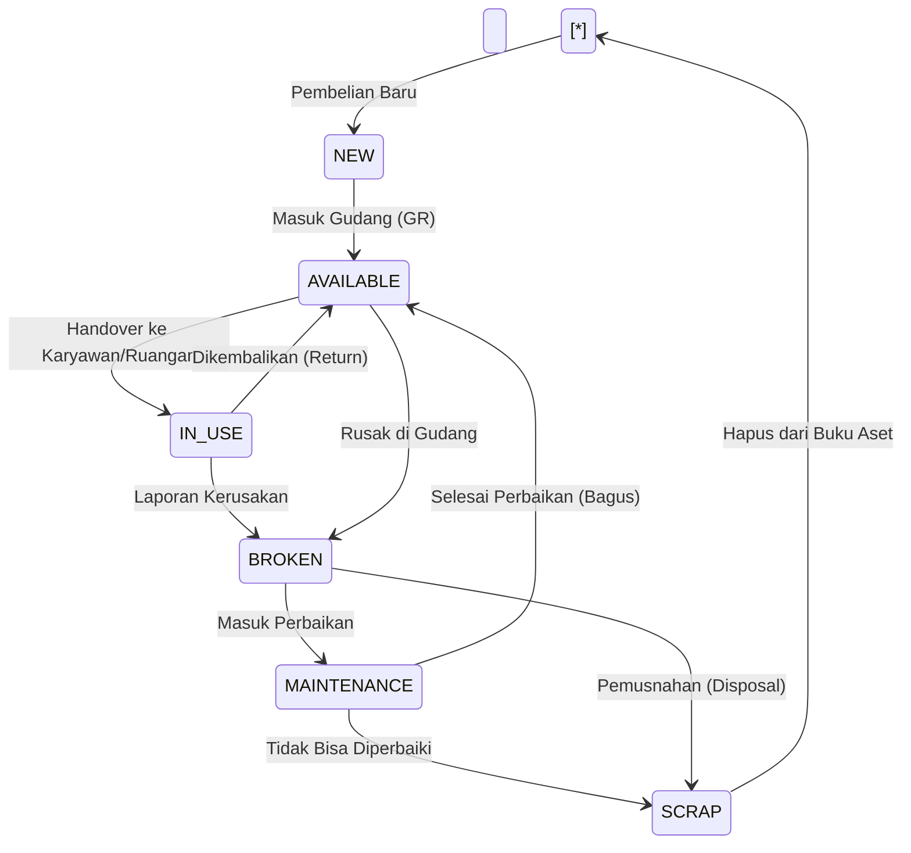

Berikut adalah \*\*Dokumen Desain Alur Proses (Process Flow Design Document)\*\* yang lengkap dan komprehensif.


Dokumen ini menggunakan standar \*\*BPMN (Business Process Model and Notation)\*\* untuk alur kerja dan \*\*State Machine Diagram\*\* untuk siklus hidup data. Diagram divisualisasikan menggunakan sintaks `mermaid` yang dapat langsung dirender di GitHub, Notion, atau editor markdown modern.


---


\# PROCESS FLOW DESIGN DOCUMENT

\*\*Project:\*\* Bebang Sistem Informasi (BSI)

\*\*Versi:\*\* 1.0


Dokumen ini menerjemahkan kebutuhan bisnis menjadi logika sistem yang pasti, menangani "Happy Path" (skenario sukses) dan "Edge Cases" (skenario pengecualian).


---


\## 1. Alur Kerja Umum: Approval Berjenjang (Dynamic Approval)

\*Logika ini digunakan di modul HR (Cuti, Lembur), Inventory (Permintaan Barang), dan Purchase.\*


\### Deskripsi Logika

1\.  \*\*Deteksi Approver:\*\* Sistem otomatis mencari atasan langsung berdasarkan `manager\_id` di data karyawan.

2\.  \*\*Pengecekan Ketersediaan (Delegasi):\*\* Jika atasan sedang cuti (status di HR = 'On Leave'), sistem mencari `delegate\_id` (pejabat sementara) atau naik ke atasan yang lebih tinggi (skip-level).

3\.  \*\*Timeout:\*\* Jika tidak ada respon 3x24 jam, notifikasi eskalasi dikirim ke HR Admin.


\### Diagram BPMN (Mermaid)


```mermaid

flowchart TD

&nbsp;   Start(\[User Submit Request]) --> Validate{Validasi Input?}

&nbsp;   Validate -- Tidak --> Error\[Tolak \& Tampilkan Pesan]

&nbsp;   Validate -- Ya --> FindApprover\[Cari Manager ID]

&nbsp;   

&nbsp;   FindApprover --> CheckStatus{Manager Aktif \& Tidak Cuti?}

&nbsp;   

&nbsp;   CheckStatus -- Tidak (Cuti) --> FindDelegate\[Cari Delegasi / Skip Level]

&nbsp;   FindDelegate --> AssignApprover\[Set Approver Baru]

&nbsp;   

&nbsp;   CheckStatus -- Ya --> AssignApprover\[Set Approver: Manager]

&nbsp;   

&nbsp;   AssignApprover --> Notify\[Kirim Notifikasi Email/WA]

&nbsp;   Notify --> WaitAction(Menunggu Respon Manager)

&nbsp;   

&nbsp;   WaitAction -->|Approve| ExecuteAction\[Update Status: APPROVED]

&nbsp;   WaitAction -->|Reject| RejectAction\[Update Status: REJECTED]

&nbsp;   WaitAction -->|Timeout > 3 hari| Escalate\[Eskalasi ke HR Admin]

&nbsp;   

&nbsp;   ExecuteAction --> Finalize\[Jalankan Logika Bisnis\\n(Potong Cuti/Kirim Barang)]

&nbsp;   Finalize --> End(\[Selesai])

&nbsp;   RejectAction --> End

```


---


\## 2. Alur Mutasi Barang: Gudang ke Karyawan (Asset Handover)

\*Integrasi kritis antara Modul Inventory dan Modul HR.\*


\### Deskripsi Logika

1\.  \*\*Trigger:\*\* Storeman memilih barang di gudang dan memilih karyawan penerima.

2\.  \*\*Validasi:\*\* Barang harus status `AVAILABLE`.

3\.  \*\*Proses:\*\* Barang berpindah secara sistem, namun statusnya menjadi `PENDING\_HANDOVER` sampai ada bukti serah terima.

4\.  \*\*Finalisasi:\*\* Upload foto/tanda tangan digital mengubah status menjadi `IN\_USE` dan aset muncul di profil karyawan.


\### Diagram Alur (Mermaid)


```mermaid

sequenceDiagram

&nbsp;   participant Storeman

&nbsp;   participant System

&nbsp;   participant InventoryDB

&nbsp;   participant EmployeeProfile

&nbsp;   participant AuditTrail


&nbsp;   Storeman->>System: 1. Pilih Barang \& Karyawan

&nbsp;   System->>InventoryDB: Cek Status Barang (Available?)

&nbsp;   InventoryDB-->>System: OK

&nbsp;   

&nbsp;   Storeman->>System: 2. Generate Berita Acara (BA)

&nbsp;   System->>Storeman: Tampilkan QR Code / Form TTD

&nbsp;   

&nbsp;   Storeman->>System: 3. Upload Foto/TTD Digital Karyawan

&nbsp;   System->>InventoryDB: Update Stok: Qty -1 / Status 'IN\_USE'

&nbsp;   System->>EmployeeProfile: Insert Record: 'Asset Holding'

&nbsp;   

&nbsp;   System->>AuditTrail: Log Activity (Who, What, When)

&nbsp;   System-->>Storeman: Sukses!

```


---


\## 3. Alur Check-in Mess (Akomodasi)

\*Menangani konflik kamar penuh dan aturan gender.\*


\### Deskripsi Logika

1\.  \*\*Filter Cerdas:\*\* Saat admin memilih karyawan, sistem otomatis memfilter kamar yang tersedia berdasarkan:

&nbsp;   \*   \*\*Gender:\*\* Kamar Wanita tidak muncul untuk Karyawan Pria (kecuali setting Family).

&nbsp;   \*   \*\*Kapasitas:\*\* Kamar dengan `current\_occupant >= max\_capacity` disembunyikan.

2\.  \*\*Pencatatan:\*\* Update status kamar dan riwayat hunian karyawan.


\### Diagram BPMN (Mermaid)


```mermaid

flowchart TD

&nbsp;   Start(\[Admin Memilih Karyawan]) --> GetEmpData\[Ambil Data: Gender \& Jabatan]

&nbsp;   GetEmpData --> FilterRooms\[Query Kamar Tersedia]

&nbsp;   

&nbsp;   FilterRooms --> Rule1{Cek Gender Blok}

&nbsp;   Rule1 -- Pria masuk Blok Wanita --> Exclude1\[Sembunyikan Kamar]

&nbsp;   Rule1 -- Cocok --> Rule2{Cek Kapasitas}

&nbsp;   

&nbsp;   Rule2 -- Penuh --> Exclude2\[Sembunyikan Kamar]

&nbsp;   Rule2 -- Tersedia --> ShowList\[Tampilkan Daftar Kamar]

&nbsp;   

&nbsp;   ShowList --> AdminSelect\[Admin Pilih Kamar]

&nbsp;   AdminSelect --> Confirm\[Konfirmasi Check-in]

&nbsp;   

&nbsp;   Confirm --> UpdateMessDB\[Update: mess\_penghuni +1]

&nbsp;   Confirm --> UpdateEmpDB\[Update: Lokasi Karyawan]

&nbsp;   Confirm --> GenHistory\[Catat History Check-in]

&nbsp;   

&nbsp;   GenHistory --> End(\[Selesai])

```


---


\## 4. State Diagram: Siklus Hidup Aset (Asset Lifecycle)

\*Mengatur status barang di database `inventory` agar stok akurat.\*


Ini adalah logika \*\*State Machine\*\* yang harus diterapkan di backend untuk mencegah perubahan status yang ilegal (contoh: Barang `RUSAK` tidak bisa langsung dipinjamkan ke karyawan).


\### Diagram State (Mermaid)





\*\*Penjelasan State:\*\*

\*   \*\*NEW:\*\* Barang baru didaftarkan, belum siap pakai (mungkin butuh label).

\*   \*\*AVAILABLE:\*\* Ada di gudang, siap didistribusikan.

\*   \*\*IN\_USE:\*\* Sedang dipegang karyawan atau dipasang di gedung. (Stok Gudang = 0 untuk item ini).

\*   \*\*BROKEN:\*\* Rusak, menunggu keputusan.

\*   \*\*MAINTENANCE:\*\* Sedang di servis.

\*   \*\*SCRAP:\*\* Barang afkir/sampah, siap dihapus/dilelang.


---


\## 5. Alur Import Data Excel (Mass Upload)

\*Mencegah data korup masuk ke database saat migrasi data.\*


\### Deskripsi Logika

1\.  \*\*Validasi Header:\*\* Cek apakah format Excel sesuai template.

2\.  \*\*Validasi Baris (Row-Level Validation):\*\* Loop setiap baris.

&nbsp;   \*   Cek NIK Duplikat.

&nbsp;   \*   Cek apakah Kode Jabatan ada di Master Data? Jika tidak, \*Reject\* baris tersebut.

3\.  \*\*Atomic Transaction:\*\* Gunakan Database Transaction. Jika 1 baris error kritis, apakah batalkan semua atau skip yang error?

&nbsp;   \*   \*Keputusan:\* \*\*Skip Error \& Report\*\*. Masukkan yang benar, buat file log Excel berisi baris yang gagal beserta alasannya.


\### Diagram Alur (Mermaid)


```mermaid

flowchart LR

&nbsp;   Upload\[User Upload Excel] --> Parse\[Parsing File]

&nbsp;   Parse --> HeaderCheck{Header Valid?}

&nbsp;   

&nbsp;   HeaderCheck -- Tidak --> RejectAll\[Tolak File]

&nbsp;   HeaderCheck -- Ya --> LoopRow\[Loop Setiap Baris]

&nbsp;   

&nbsp;   LoopRow --> ValRef{Cek Referensi Master Data\\n(Jabatan/Divisi ada?)}

&nbsp;   ValRef -- Tidak Ada --> MarkError\[Tandai Baris Error]

&nbsp;   ValRef -- Ada --> ValDup{Cek Duplikat NIK}

&nbsp;   

&nbsp;   ValDup -- Duplikat --> MarkError

&nbsp;   ValDup -- Unik --> AddBatch\[Masukan ke Batch Insert]

&nbsp;   

&nbsp;   AddBatch --> NextRow{Ada baris lain?}

&nbsp;   NextRow -- Ya --> LoopRow

&nbsp;   NextRow -- Tidak --> ExecuteDB\[Jalankan Insert DB]

&nbsp;   

&nbsp;   ExecuteDB --> GenReport\[Generate Laporan: \\nSukses: 450, Gagal: 5]

&nbsp;   GenReport --> End(\[Tampilkan ke User])

```


---


\## 6. Integrasi System Event (Observer Pattern)

Bagaimana satu aksi memicu banyak reaksi tanpa membuat kode berantakan (Spaghetti Code).


\*\*Contoh Kasus: Karyawan Resign\*\*

Ketika HR mengubah status karyawan menjadi `RESIGNED`:

1\.  \*\*HR Module:\*\* Update status \& tanggal berhenti.

2\.  \*\*User Access Module:\*\* Otomatis menonaktifkan akun login (User cannot login).

3\.  \*\*Inventory Module:\*\* Cek apakah masih ada aset status `IN\_USE`? Jika ya, kirim alert "Asset Return Pending" ke Gudang.

4\.  \*\*Mess Module:\*\* Cek apakah masih menghuni Mess? Jika ya, trigger status "To be Checked-out".


Diagram ini penting untuk Backend Developer dalam menerapkan \*\*Event-Driven Architecture\*\*.

